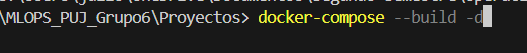

# Desarrollo de un Pipeline de Machine Learning con TFX y Docker

Este repositorio contiene los archivos y configuraciones necesarios para el desarrollo, ejecución y análisis de un pipeline de **TensorFlow Extended (TFX)**, facilitando la automatización y trazabilidad en el procesamiento de datos para tareas de Machine Learning.

##      Estructura del Directorio:

```plaintext
📁 Proyecto1 
|── 📁images
    |── 📄dockerCompose.png         # Pantallazo del comando de docker-compose
    |── 📄notebook.png              # Pantallazo del notebook del contenedor
|── 📄Proyecto1.ipynb               # Notebooks de JupyterLab con el desarrollo
|── 📄pyproject.toml                # Configuración de dependencias con uv
|── 📄dockerfile                    # Construcción de la imagen para creación de la imagen del contenedor
|── 📄README.md                     # Documentación del proyecto
```

##      Requisitos Previos  

Antes de ejecutar el notebook, asegúrate de contar con los siguientes requisitos:

-       Docker y Docker-Compose (para garantizar entornos reproducibles y aislados).

-       Un entorno de desarrollo o terminal compatible con Docker, como:

    -       VS Code (recomendado con la extensión Remote - Containers).

    -       PyCharm (con soporte para Docker).

    -       Cualquier terminal que permita la ejecución de Docker y la gestión de contenedores.

-       UV (gestor de entornos y dependencias para Python).

**Nota:** Se recomienda ejecutar el **notebook** dentro del entorno configurado en el contenedor de **Docker**. La gestión de dependencias a través de **UV** permite mantener la estabilidad del entorno de ejecución, minimizando conflictos entre **TFX** y otras librerías esenciales como **NumPy**. Dado que TFX puede presentar problemas de compatibilidad con diferentes versiones de dependencias, la ejecución dentro del contenedor garantiza la consistencia y reproducibilidad del **pipeline**.

##      Configuración del Entorno

El entorno de ejecución ha sido diseñado para garantizar reproducibilidad y estabilidad en la implementación del pipeline. Para ello, se proporciona un Dockerfile, encargado de construir la imagen con todas las dependencias requeridas. Esta configuración permite la ejecución en un entorno aislado y controlado, asegurando la correcta gestión de los recursos computacionales y la compatibilidad con las herramientas utilizadas en el flujo de trabajo.

##      Descripción del Pipeline

El pipeline desarrollado dentro de este repositorio permite la ingesta, validación, transformación y análisis de datos, garantizando trazabilidad y reproducibilidad en todo el proceso. Para ello, se apoya en TFX y en ML Metadata (MLMD) para la gestión y almacenamiento de metadatos, proporcionando un marco robusto para la experimentación y evolución del modelo.

El repositorio incluye un notebook de JupyterLab, en el cual se detallan los pasos del pipeline y se ilustran las transformaciones aplicadas a los datos. Este enfoque facilita la exploración interactiva y la depuración de cada componente, promoviendo buenas prácticas en el desarrollo de soluciones de Machine Learning basadas en TFX.

Para este caso tenemos seguro lo siguiente:  

-   El Dockerfile garantiza la portabilidad del entorno, permitiendo ejecutar el pipeline de manera consistente en diferentes máquinas.

-   El directorio del proyecto proporciona las guías y notebook necesario para la manipulación del pipeline y la ejecución de TFX dentro de JupyterLab.

Este enfoque facilita la reproducibilidad del experimento y asegura un entorno controlado para el manejo de ML Metadata (MLMD) y la canalización de datos dentro de TFX. 


##      Despliegue del Proyecto

El despliegue del entorno se realiza mediante Docker-Compose, lo que permite la inicialización y administración de los contenedores de manera eficiente. Para ello, se debe ejecutar el siguiente comando dentro del directorio que contiene el archivo **docker-compose.yaml**:

```Bash
docker-compose --build -d
```
Nota: Se recomienda ejecutar el comando desde el mismo directorio donde se encuentra el archivo docker-compose.yaml. Si necesitas navegar entre directorios en la terminal, puedes consultar esta [guía rapida](https://terminalcheatsheet.com/es/guides/navigate-terminal)



Una vez que el contenedor está en ejecución, se puede acceder a la interfaz de JupyterLab desde cualquier navegador con acceso a la terminal donde está activo el contenedor. Para ello, basta con ingresar la siguiente URL en el navegador:

```Bash
http://localhost:8888/lab 
```

Al acceder a JupyterLab, se encontrará disponible el notebook **Proyecto1.ipynb**, el cual contiene todo el desarrollo del pipeline de TFX, la gestión de metadatos con MLMD, así como descripciones detalladas del proceso y su implementación paso a paso.

Este enfoque proporciona un entorno de trabajo estructurado, reproducible y escalable para el desarrollo de modelos de Machine Learning, asegurando buenas prácticas en la implementación de pipelines con TFX.


##      Despliegue del Contenedor sin Docker-Compose

Para ejecutar el contenedor sin utilizar Docker-Compose, se puede recurrir a los siguientes comandos:

```Bash
docker build -t ml_dev_img .
docker run -p 8888:8888 --name ml_dev -v ${PWD}:/workspace -it ml_dev_img
```

Este enfoque permite ejecutar el entorno sin depender de docker-compose, montando el directorio de trabajo (${PWD}) en el contenedor. Es importante notar que los archivos creados o modificados dentro de JupyterLab quedarán almacenados en la carpeta local del proyecto, ya que no se está utilizando un volumen administrado por Docker.

**Finalización y Eliminación del Contenedor**

Para detener el contenedor en ejecución, presionar **Ctrl + C** en la terminal donde se ejecutó el comando **docker run**. Esto enviará la señal para terminar el proceso y detener JupyterLab dentro del contenedor.

Para eliminar el contenedor y liberar los recursos asociados, se debe ejecutar el siguiente comando:

```Bash 
docker rm ml_dev
```
Si se requiere eliminar por completo la imagen utilizada para el contenedor, se debe ejecutar:

```Bash
docker rmi ml_dev_img
```

Esto asegurará que la imagen se elimine completamente y evitará que se despliegue un nuevo contenedor basado en ella, a menos que se vuelva a construir con **docker build**.


##      Referencias

-   [covertype data](https://archive.ics.uci.edu/ml/datasets/covertype)

-   [univariate feature selection](https://scikit-learn.org/stable/modules/feature_selection.html#univariate-feature-selection)

-   [pipeline components](https://www.tensorflow.org/tfx/api_docs/python/tfx/v1/components)

-   [TFX](https://www.tensorflow.org/tfx/guide?hl=es)

-   [MLMD](https://www.tensorflow.org/tfx/guide/mlmd?hl=es)