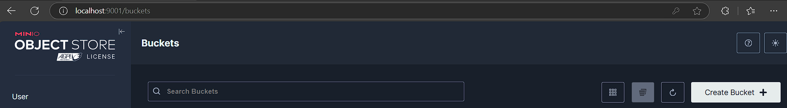
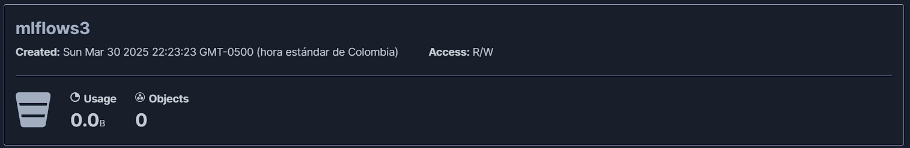
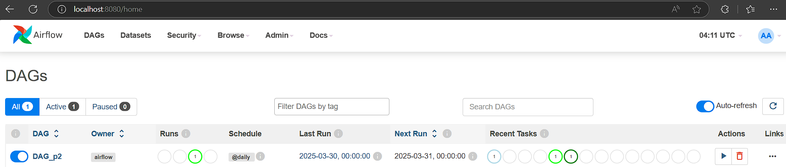
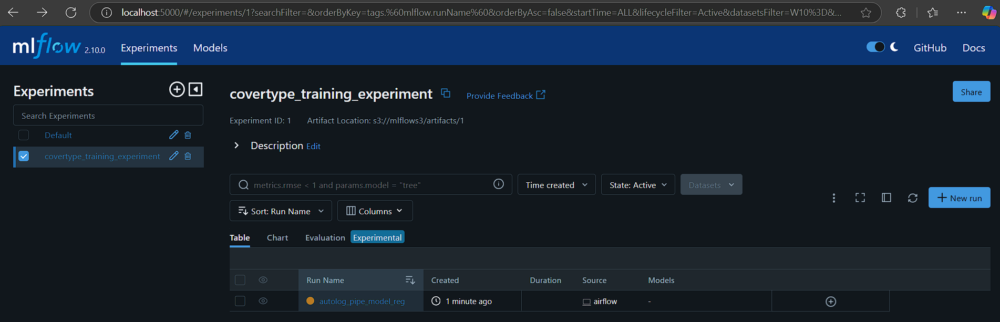
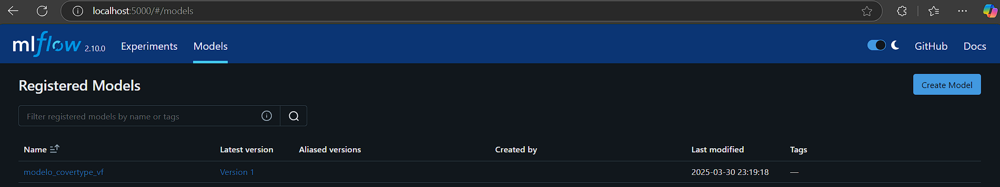
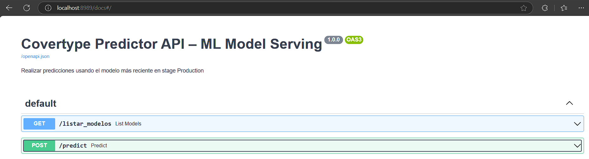
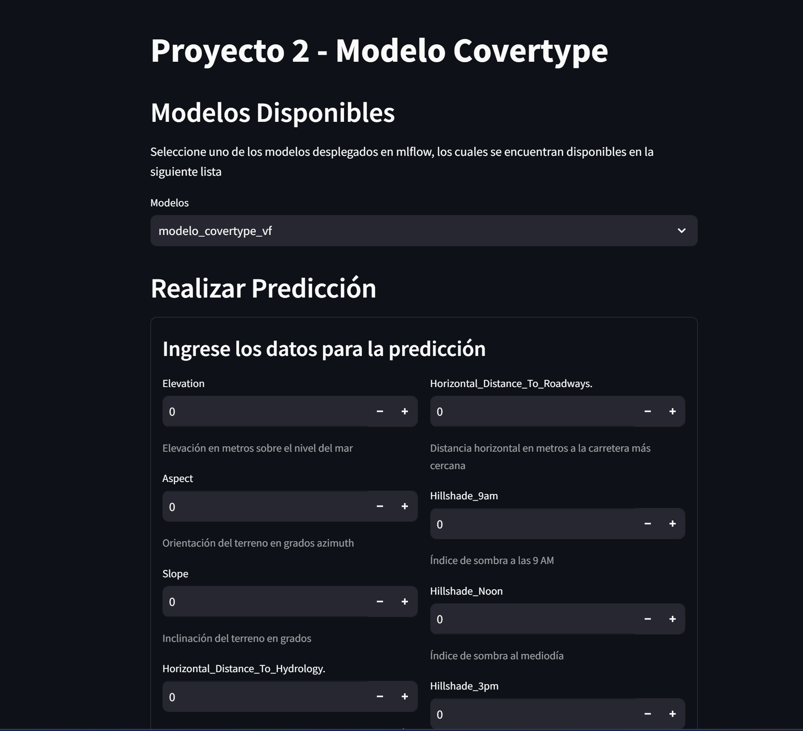
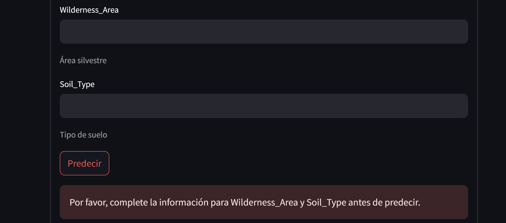

#       Desarrollo Proyecto 2

Este repositorio contiene los archivos y configuraciones necesarios para el despliegue de un entorno completo que integra los servicios de **Airflow**, **MLflow**, **MinIO**, **FastAPI**, **MySQL** y **Streamlit**. Este ecosistema permite implementar un flujo de trabajo integral para la ingesta, procesamiento, modelado, registro y despliegue de modelos de machine learning, todo gestionado desde un DAG orquestado con Airflow.

La arquitectura propuesta permite explorar y aplicar principios de MLOps, haciendo énfasis en la trazabilidad, el versionamiento y la automatización del ciclo de vida de los modelos. El flujo del proceso incluye la obtención de datos mediante una **API**, su almacenamiento en una base de datos, el preprocesamiento y entrenamiento de modelos, la selección y publicación del modelo óptimo en producción, su registro con control de versiones a través de MLflow, el consumo del modelo desde una API de predicción, y su disponibilización al usuario final mediante una interfaz interactiva construida con Streamlit.

---

##      Estructura del Directorio

A continuación se presenta la estructura del directorio del proyecto, la cual refleja cómo se organizan los archivos para el despliegue de cada uno de los servicios que componen el entorno. Además, se incluye una simulación de una fuente de datos externa a través de un segundo archivo de orquestación (**docker-compose-external.yaml**), que expone su servicio en un puerto del host.

Este servicio externo es consumido por los contenedores definidos en el archivo principal (**docker-compose-p2.yaml**) mediante una red compartida (**network**) declarada explícitamente. Esta configuración permite la lectura del puerto expuesto en el host desde dentro del ecosistema contenedorizado, garantizando la conectividad entre servicios incluso si pertenecen a diferentes composiciones de Docker.

```plaintext
📁 PROYECTO2
├── 📁 airflow                          # Configuración del orquestador de tareas (Airflow)
│   ├── 📄 Dockerfile
│   └── 📄 requirements.txt
├── 📁 app                              # API FastAPI para servir el modelo entrenado
│   ├── 📄 Dockerfile
│   ├── 📄 main.py
│   └── 📄 requirements.txt
├── 📁 dags                             # DAG de entrenamiento, registro y publicación del modelo
│   └── 📄 modeling_covertype.py
├── 📁 external                         # API alterna que simula la fuente de datos externa
│   ├── 📁 data                         # Datos de ejemplo para el servicio simulado
│   ├── 📄 Dockerfile
│   ├── 📄 main.py
│   └── 📄 requirements.txt
├── 📁 images                           # Imagenes complementarías del proceso
├── 📁 logs                             # Archivos generados por Airflow durante la ejecución
│   ├── 📁 dag_id=DAG_p2
│   ├── 📄 dag_processor_manager
│   └── 📄 scheduler
├── 📁 mlflow                           # Configuración adicional para el servidor de MLflow
│   ├── 📄 Dockerfile
│   └── 📁 plugins
├── 📄 .env                             # Variables de entorno para configuración de servicios
├── 📄 docker-compose-external.yaml     # Orquestación de la API alterna
├── 📄 docker-compose-p2.yaml           # Despliegue completo del entorno de producción
├── 📄 README.md                        # Este archivo
└── 📄 streamlit_app.py                 # Interfaz de usuario para consumo del modelo
```

Esta organización modular permite una gestión eficiente de cada componente del flujo de datos y facilita la escalabilidad del entorno.

---

##      Despliegue de API Alterna

Iniciamos con el despliegue de la API que simula la entrega de datos, la cual se ejecuta en el host y representa la fuente externa de información que alimenta el flujo de trabajo MLOps implementado en este experimento. Este servicio fue proporcionado por el profesor como base para poder interactuar con una API realista durante el desarrollo del proyecto.

Contar con una fuente de datos activa es fundamental para el funcionamiento del DAG de Airflow, ya que este será responsable de orquestar la ingesta, el procesamiento y el entrenamiento del modelo. La API garantiza una entrega periódica de datos que simula un entorno de producción o streaming.

Para levantar este servicio, utilizamos el siguiente comando desde la terminal:

```bash
sudo docker compose -f docker-compose-external.yaml up --build -d
```

Para verificar que el servicio se encuentra en línea y operativo, podemos ejecutar los siguientes comandos desde la terminal. Estos permiten comprobar que el servidor responde correctamente tanto a una solicitud base como a la entrega de datos parametrizada:

```bash
curl http://localhost:80/
curl "http://localhost:80/data?group_number=6"
```

El primer comando valida que el servicio esté activo, mientras que el segundo confirma que el endpoint de entrega de datos esté funcionando y retornando información en formato JSON, lo cual es esencial para la ingesta dentro del DAG de Airflow.

En contraparte, para dar de baja el servicio, eliminando también los volúmenes asociados y las imágenes generadas durante el despliegue, ejecutamos el siguiente comando desde la terminal:

```bash
sudo docker compose -f docker-compose-external.yaml down -v --rmi all
```
Este procedimiento garantiza una limpieza completa del entorno relacionado con el servicio de entrega de datos, permitiendo su redeploy sin conflictos residuales en futuras ejecuciones.

---

##      Despliegue del Esquema Completo

Se orquestan los siguientes servicios:
- **Airflow**: planificación y ejecución del pipeline
- **MySQL (x2)**: almacenamiento de datos suministrados y metadata de MLflow
- **MLflow**: tracking, registro y gestión del modelo
- **MinIO**: almacenamiento de artefactos con compatibilidad S3
- **FastAPI**: API REST para servir el modelo entrenado

##      Comandos para Levantar el Entorno

Los siguientes comandos son necesarios para el correcto despliegue del entorno. En primer lugar, se inicializa la configuración base de Airflow mediante su proceso de airflow-init, y posteriormente se levantan todos los servicios definidos en el archivo de orquestación, incluyendo la red compartida (network) que interconecta los contenedores, así como el acceso al servicio externo de datos expuesto en el host:

```bash
sudo docker compose -f docker-compose-p2.yaml up airflow-init
sudo docker compose -f docker-compose-p2.yaml up --build -d
```

Esta secuencia garantiza que la base de datos, los volúmenes persistentes, la red interna y los contenedores se encuentren correctamente configurados y en ejecución, permitiendo así el funcionamiento integral del flujo MLOps.

El siguiente comando permite desmontar por completo el entorno, eliminando todos los contenedores, volúmenes persistentes e imágenes generadas durante su despliegue. Es útil en caso de requerir una reconstrucción limpia del entorno desde cero:

```bash
sudo docker compose -f docker-compose-p2.yaml down -v --rmi all
```

Esta operación asegura que no queden residuos de configuraciones anteriores, evitando posibles conflictos al volver a levantar los servicios.


##      Accesos a servicios

A continuación, se listan los servicios definidos dentro del archivo docker-compose-p2.yaml, los cuales conforman el entorno completo del experimento:

| Servicio     | URL                       | Usuario   | Contraseña     |
|--------------|---------------------------|-----------|----------------|
| Airflow      | http://localhost:8080     | airflow   | airflow        |
| MLFlow       | http://localhost:5000     | -         | -              |
| MinIO        | http://localhost:9001     | admin     | supersecret    |
| MySQL(MLFlow)| -                         | mlflow    | mlflow         |
| MySQL(data)  | -                         | admin     | supersecret    |
| FastAPI      | http://localhost:8989     | -         | -              |


##      Verificación de los Servicios   

Para verificar que todos los servicios se encuentran activos y funcionando correctamente, se puede consultar el estado de los contenedores y los puertos expuestos mediante el siguiente comando:

```bash
docker ps -a
```
Este comando lista todos los contenedores en ejecución (y detenidos), junto con información relevante como el nombre del contenedor, su estado y los puertos mapeados hacia el host. Esto permite confirmar que los servicios están levantados y accesibles desde las interfaces correspondientes.

En caso de que algún contenedor presente errores o no se encuentre en ejecución (estado "exited" o "dead"), se recomienda revisar sus logs para identificar la causa del fallo. Esto se puede hacer mediante el siguiente comando:

```bash
docker logs <nombre-del-contenedor>
```

Es importante tener en cuenta que el contenedor airflow-init-1 puede aparecer en estado exited sin que ello represente un error, ya que su única función es inicializar la configuración del entorno durante el arranque. Una vez completada esta tarea, se detiene automáticamente, y no requiere intervención adicional.

Para verificar que MLflow y su conexión con la base de datos de metadatos (MySQL) se hayan levantado correctamente, se puede inspeccionar el log del contenedor correspondiente utilizando el siguiente comando:

```bash
docker logs mlflow
```
Dentro de los registros de salida, es fundamental identificar las siguientes líneas, que confirman una conexión exitosa con la base de datos y la correcta inicialización del entorno de tracking:

```text
INFO [alembic.runtime.migration] Context impl MySQLImpl.
INFO [alembic.runtime.migration] Running upgrade  -> <hash>
```

La aparición de estos mensajes indica que MLflow ha logrado conectarse al motor MySQL configurado como metadata store y que las migraciones de esquema se han aplicado correctamente. Si estos mensajes no aparecen, o se observan errores previos de conexión, se recomienda revisar los parámetros de acceso definidos en el archivo docker-compose-p2.yaml y en las variables de entorno del contenedor.

> ⚠️ Puede que los primeros intentos de conexión fallen. Lo importante es que finalmente se observe la conexión exitosa en los logs.

---

##      Creción del Bucket en MinIO 

Para crear el bucket donde se almacenarán los artefactos generados por los modelos entrenados a través del DAG de Airflow, accedemos a la interfaz web de MinIO desde cualquier navegador utilizando la siguiente URL:

```bash
http://localhost:9001
```

Al ingresar, se presentará la página de inicio de sesión. Se deben utilizar las credenciales previamente definidas:

-   Usuario: admin

-   Contraseña: supersecret

Una vez autenticados, navegamos a la opción "**Create Bucket**", ubicada en la parte superior derecha de la interfaz. En este paso, es fundamental asignar al bucket el nombre mlflows3, ya que este valor ha sido predefinido en la configuración del entorno y es el que espera MLflow para operar correctamente.

Este bucket actuará como repositorio de artefactos, permitiendo que MLflow almacene los modelos entrenados, métricas, parámetros y otros elementos generados durante la ejecución del pipeline definido en el DAG de Airflow.



Para verificar que el bucket fue creado correctamente, este deberá aparecer en la lista principal del panel de MinIO, tal como se muestra a continuación:



##      Configuración de Airflow

Accedemos a la interfaz web de Airflow a través de la siguiente URL en el navegador:

```bash
http://localhost:8080
```

Una vez en la página de inicio de sesión, utilizamos las credenciales previamente establecidas para autenticarnos. Luego, nos dirigimos a la sección "Admin" > "Connections", desde donde creamos una nueva conexión que permitirá establecer la comunicación con el servicio de MySQL, encargado del almacenamiento de los datos recolectados desde la API externa.


Esta conexión es fundamental para que el DAG pueda interactuar con la base de datos y ejecutar operaciones de lectura y escritura de forma programática durante su ejecución. A continuación, se detallan los parámetros que deben ser configurados al momento de crear la conexión a MySQL dentro de la interfaz de Airflow:

- **Connection ID**: `mysql_default`
- **Connection Type**: `MySQL`
- **Host**: `mysql-data-store`
- **Schema**: `datadb`
- **Login**: `admin`
- **Password**: `supersecret`
- **Port**: `3306`

Una vez ingresados estos datos, se guarda la conexión para que esté disponible desde los hooks definidos en el código del DAG. Esta conexión será utilizada, por ejemplo, por MySqlHook para insertar registros, consultar datos y verificar la existencia de tablas durante la ejecución del pipeline.



Una vez creada la conexión, podemos regresar a la página principal de Airflow y habilitar el DAG llamado **DAG_p2**, encargado de ejecutar de forma orquestada todo el flujo de trabajo del experimento. Este DAG implementa las siguientes tareas:

-   Ingesta de datos desde la API externa.

-   Entrenamiento de un modelo utilizando GridSearchCV para búsqueda de hiperparámetros.

-   Evaluación del modelo y registro automático de métricas en MLflow.

-   Publicación del modelo entrenado en el MLflow Model Registry.

-   Promoción automática del mejor modelo al stage Production.

-   Almacenamiento de los artefactos del modelo (pipeline, parámetros, métricas) en MinIO.

⚠️ Advertencia: Es importante asegurarse de que el DAG no se encuentre ejecutándose múltiples veces en paralelo. El flujo ha sido diseñado para ejecutarse de forma secuencial, por lo que correr dos instancias simultáneas puede provocar conflictos en el acceso a recursos compartidos como la base de datos o el registro del modelo en MLflow.

---

##      Revisión de los Resultados en MLFlow    

Una vez finalizada la ejecución del DAG en Airflow, accedemos a la interfaz de MLflow a través del navegador utilizando la URL:

```bash
http://localhost:5000
```

Dentro de la plataforma, navegamos al experimento denominado **covertype_training_experiment**, donde podremos visualizar la ejecución más reciente del pipeline. Al ingresar a la corrida correspondiente, es posible observar las métricas del modelo entrenado, tales como accuracy, precision, recall y f1-score.

Adicionalmente, al acceder en detalle a la ejecución, se pueden consultar los parámetros utilizados durante el ajuste del modelo, los artefactos generados (como el modelo serializado, el pipeline completo, gráficos, etc.) y los registros adicionales almacenados automáticamente gracias al uso de **mlflow.sklearn.autolog()**.

Esta trazabilidad permite comparar múltiples ejecuciones y mantener un historial completo del desempeño de cada configuración de entrenamiento.



Una vez verificado el experimento desarrollado, también es posible comprobar que el modelo ha sido promovido a producción. Para ello, accedemos a la pestaña **Models** dentro de la interfaz de MLflow, donde encontraremos el modelo registrado bajo el nombre modelo_covertype_vf.

Al hacer clic sobre el nombre del modelo, se despliega la lista de versiones registradas. La versión más reciente (generada por el DAG) deberá estar marcada con el estado Production, lo que indica que ha sido seleccionada como la versión oficial para ser consumida por otros servicios.

Al ingresar a la versión específica, podemos observar detalles adicionales como el (run_id), el experimento de origen, las métricas asociadas, el autor del registro y la ubicación de los artefactos almacenados. Esta información es clave para mantener trazabilidad y control de versiones dentro del flujo MLOps.



##      Revisión de la Disponibilidad del Modelo

Finalmente, accedemos a la API de inferencia desarrollada con FastAPI a través del siguiente enlace en el navegador o utilizando herramientas como curl o Postman:

```bash
http://localhost:8989/docs
```

Esta API se encuentra conectada directamente al MLflow Model Registry y ha sido configurada para consumir la versión del modelo que se encuentra en estado Production. Desde esta interfaz, es posible enviar datos de entrada al modelo entrenado y recibir una predicción como respuesta, validando así que el flujo de entrenamiento, publicación y despliegue fue exitoso.

Esta API actúa como puente entre el modelo publicado y los servicios o usuarios finales que requieren realizar inferencias sobre nuevos datos.



##      Visualización e Inferencia con Streamlit

Como complemento al entorno desarrollado, se implementó una interfaz gráfica de usuario (UI) utilizando Streamlit, con el objetivo de permitir que un usuario final pueda interactuar fácilmente con el modelo entrenado y realizar predicciones de forma manual e intuitiva.

Primero, asegúrese de que el entorno de desarrollo cuente con la biblioteca Streamlit instalada. Luego, para iniciar la interfaz, ejecute el siguiente comando en la terminal:

```bash
streamlit run streamlit_app.py --server.port 8503
```
Una vez iniciado el servicio, la aplicación estará disponible en el navegador accediendo a la URL:

```bash
http://localhost:8503
```

Desde esta interfaz, el usuario puede ingresar manualmente los valores de entrada requeridos por el modelo y obtener la predicción en tiempo real. Por defecto, el comando abre automáticamente el navegador al iniciar el servidor y permanece activo mientras se mantenga la terminal abierta. La interfaz de streamlit se verá de la siguiente forma: 

<div align="center">
  
</div>

Streamlit está completamente integrado con las APIs proporcionadas previamente mediante FastAPI. Los detalles de esta integración se pueden consultar en el archivo [`streamlit_app.py`](./streamlit_app.py) presente en este repositorio. En la sección **Modelos**, la aplicación invoca automáticamente el método `listar_modelos`, el cual muestra el listado completo de los modelos desplegados en MLflow y disponibles para su uso.  Adicionalmente, la interfaz permite ingresar los valores correspondientes a cada variable para realizar la predicción; por defecto, las variables numéricas se inicializan en `0` y las categóricas se dejan en blanco.

Por último, se confirma que se implementaron validaciones en algunos de los campos para garantizar la integridad de los datos ingresados. En caso de que los valores no cumplan con las especificaciones definidas para cada variable, se mostrará un mensaje de error similar al siguiente:

<div align="center">
  
</div>

Se implementaron las siguientes validaciones:

1. **Valores no negativos:** Ninguna variable puede tener un valor numérico negativo.
2. **Variables categóricas obligatorias:** Los campos categóricos no pueden estar vacíos.
3. **Rangos válidos:** Según la naturaleza de cada variable y la documentación del conjunto de datos, se definieron rangos válidos que limitan los valores aceptados.

Si alguno de los datos ingresados no cumple con estas condiciones, se mostrará un mensaje de error claro y descriptivo que guía al usuario en la corrección del dato.

Además, en caso de que el API llegue a fallar por cualquier motivo, la interfaz de Streamlit está configurada para capturar y mostrar el error correspondiente, permitiendo que el desarrollador pueda identificar rápidamente la causa del problema y tomar acciones correctivas.

Aunque en este experimento la aplicación fue ejecutada localmente, el servicio puede ser fácilmente **dockerizado** e integrado en futuros entornos contenedorizados, permitiendo su despliegue como parte de flujos de trabajo completos en ambientes de producción.

Adicionalmente, es posible integrarlo con herramientas como **Ngrok**, lo cual facilita el acceso a la aplicación desde diferentes equipos mediante la publicación de una **URL pública**, útil especialmente durante fases de desarrollo colaborativo, pruebas o demostraciones remotas.

---

##      Aclaraciones del Código

Este proyecto nace a partir de las bases proporcionadas por el profesor. Se realizaron ajustes clave para permitir:

- Un entorno dockerizado y replicable
- Un esquema de orquestación con dependencias entre servicios
- Entrenamiento supervisado automatizado vía Airflow
- Registro de métricas y artefactos en MLflow y MinIO
- Promoción automática del mejor modelo al stage "Production"
- Consumo del modelo vía FastAPI y visualización con Streamlit

Gracias a este enfoque, se garantiza la reproducibilidad del experimento, la trazabilidad de los modelos y una estructura modular para posibles integraciones futuras en ambientes de desarrollo reales o en producción.

