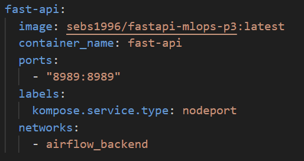
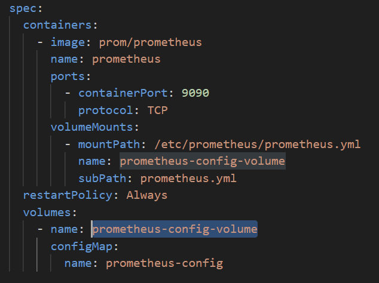
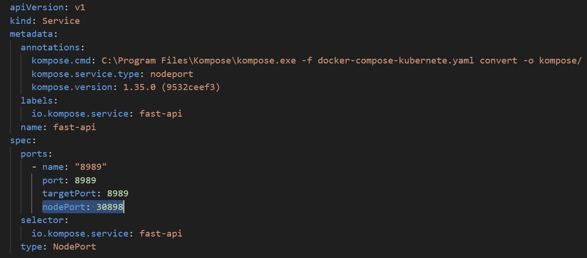
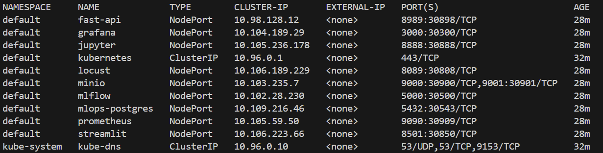
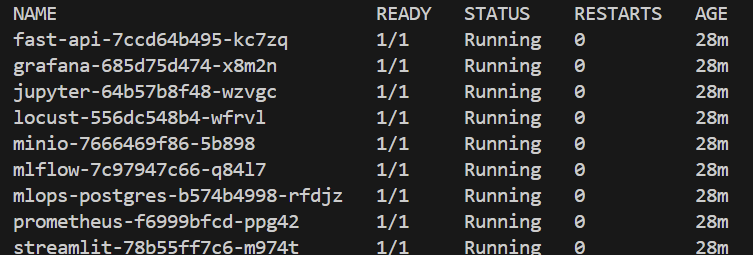

Iniciamos la red host para la comunicación de airflow con los demás servicios 

```bash
docker network create airflow_backend
```

Iniciamos con el proceso arrancando el todos los servicios en docker compose con los servicios generales (airflow por seperado) usando 

```bash 
sudo docker compose -f docker-compose-resto.yaml up --build -d
sudo docker compose -f docker-compose-resto.yaml up fast_api --build -d
sudo docker compose -f docker-compose-resto.yaml up locust --build -d
```

```bash
sudo docker compose -f docker-compose-resto.yaml down --rmi all -v
```

revisamos la exposición de los servicios entrando a sus puertos en el localhost 

(tomar encuenta, estamos usando el mismo puerto que se usa dentro de docker como en el localhost, esto nos puede facilitar el proceso de conexiones más adelante)

```bash 
http://localhost:8989       fastapi
http://localhost:8501       streamlit
http://localhost:3000       grafana
http://localhost:5000       mlflow
http://localhost:9090       promehteus
http://localhost:9001       minio
```

Se levanta airflow con 
```bash
sudo docker compose -f docker-compose-airflow.yaml up airflow-init
sudo docker compose -f docker-compose-airflow.yaml up --build -d
```

```bash
sudo docker compose -f docker-compose-airflow.yaml down --rmi all -v
```

```bash 
http://localhost:8080
```


docker compose -f docker-compose-airflow.yaml exec airflow-scheduler ls -l /opt/airflow/dags


```bash 
sudo docker compose -f docker-compose-jupyter.yaml up --build -d
```

```bash
sudo docker compose -f docker-compose-jupyter.yaml down --rmi all -v
```

```bash
http://localhost:8888       jupyter
```


el primer dag en correr por única vez es raw_data_initial_batch_load, este DAG realiza la primer carga de los datos en la tabla de la rawdata, con este procedimiento garantizamos que se carga los datos a la rawdata y esperamos a que termine, sólo se necesita correr una primera vez

Luego seguimos con el DAG clean_data_pipeline, el cual se encarga de hacer la carga de datos de la rawdata, hace la limpieza de los mismos y los carga, es importante sólo encenderlo después de que finalice raw_data_initial_batch_load, así garantizamos que el flujo de consumo de datos quede activo, adicional, tenemos las columnas load_date y processed_date que son las columnas que nos permiten hacer seguimiento de la carga y flujo de datos en las cargas de datos


docker exec -it proyecto3-mlops-postgres-1 bash
psql -U airflow -d airflow
psql -U admin -d supersecret
\dn
\dt raw_data.*
SELECT COUNT(*) FROM raw_data.diabetes_raw;
DROP TABLE raw_data.diabetes_raw;
SELECT COUNT(*) FROM raw_data.diabetes_clean;
DROP TABLE raw_data.diabetes_clean;


Luego entramos a minio, y acá creamos el bucket `mlflows3` para que se guarden los objetos del proceso de entrenamiento de modelos del experimento

docker exec -it mlflow bash
touch test_s3.py
echo "import os, mlflow
os.environ['AWS_ACCESS_KEY_ID'] = 'admin'
os.environ['AWS_SECRET_ACCESS_KEY'] = 'supersecret'
os.environ['MLFLOW_S3_ENDPOINT_URL'] = 'http://minio:9000'
mlflow.set_tracking_uri('http://mlflow:5000')
with mlflow.start_run():
    with open('/tmp/hello.txt','w') as f: f.write('hola')
    mlflow.log_artifact('/tmp/hello.txt')
    print('Artifact URI:', mlflow.get_artifact_uri())
    print('✅ Artifact logged')
" > test_s3.py
python test_s3.py


Usando jupyter podemos examinar los datos cargados dentro del esquema, donde verificamos en los descriptivos la información junto con la documentación de la misma, así mismo, podemos darnos cuenta que el conjunto de datos está supremamente bien documentado, por lo tanto, consideramos que sólo es necesario hacer el trabajo para corregir los carácteres especiales, o valores "faltantes" que nos permita hacer una adecuación del conjunto de datos y cargarlos en el clean data 
https://archive.ics.uci.edu/dataset/296/diabetes+130-us+hospitals+for+years+1999-2008


Notas

para disminuir el consumo de contenedor al mínimo posible para poderlo desplegar en las máquinas, usaremos un solo postgres

levantamos streamlit dentro de un contenedor considerando que este paso es fácil de hacer para continuar con la conterinización de los servicios a usar 

Despliegue del docker compose 

docker compose -f docker-compose-kubernete.yaml up --build -d


docker compose -f docker-compose-resto.yaml up fast-api --build -d


# Kubernetes 

## Construcción de imágenes

Un requisito previo para la implementación de Kubernetes es que todas las imágenes de los servicios estén construidas de antemano. Para ello se crean las imágenes de forma local, se cargan en el repositorio de Docker Hub y finalmente se actualiza el archivo docker‑compose, reemplazando las referencias locales por las nuevas imágenes. Este procedimiento debe realizarse para los siguientes servicios:

- **fast-api**
```bash
docker build -t sebs1996/fastapi-mlops-p3:latest ./app
docker push sebs1996/fastapi-mlops-p3:latest
```

- **mlflow**
```bash
docker build -t sebs1996/mlflow-mlops-p3:latest ./mlflow
docker push sebs1996/mlflow-mlops-p3:latest
```


- **jupyter**
```bash
docker build -t sebs1996/jupyter-mlops-p3:latest ./jupyter
docker push sebs1996/jupyter-mlops-p3:latest
```

- **streamlit**
```bash
docker build -t sebs1996/streamlit-mlops-p3:latest ./streamlit
docker push sebs1996/streamlit-mlops-p3:latest
```

- **locust**
```bash
docker build -t sebs1996/locust-mlops-p3:latest ./locust
docker push sebs1996/locust-mlops-p3:latest
```

## Configuración NodePort
Para permitir la comunicación externa con los servicios expuestos en el clúster de Kubernetes, es necesario configurar el type del servicio como NodePort. Esto se hace en el docker-compose.yaml, añadiendo una etiqueta en la sección labels con el valor kompose.service.type: nodeport para cada servicio. A continuación se muestra un ejemplo para el servicio de FastAPI:

<div align="center">
  
</div>


## Generación de manifiestos con Kompose.

Una vez verificado el funcionamiento de la arquitectura propuesta, es necesario crear los manifiestos que habilitan el despliegue de los recursos en Kubernetes. Estos manifiestos se generarán automáticamente con **Kompose** y se almacenarán en la carpeta Kompose/ de este repositorio.

```bash
kompose -f docker-compose-kubernete.yaml convert -o kompose/
```

## Configuración de volúmenes y archivos locales

En Kubernetes los volúmenes se gestionan de manera diferente, por lo que cualquier volumen o archivo de configuración local debe convertirse en un manifiesto antes de desplegarse. Este es el caso del servicio **Prometheus**, cuyo archivo prometheus.yaml debe transformarse en un **ConfigMap** y ubicarse en la carpeta Kompose/. Por ello, se crea el manifiesto prometheus-configmap.yaml.

```bash
kubectl create configmap prometheus-config --from-file=prometheus.yml=.\prometheus.yml --dry-run=client -o yaml > prometheus-configmap.yaml
```

Además, el manifiesto *prometheus-deployment.yaml* se actualiza para montar el nuevo volumen proveniente del **ConfigMap**, garantizando que el contenedor de Prometheus cargue correctamente el archivo de configuración:

<div align="center">
  
</div>


## Configuración de los puertos 

Por defecto, cuando se despliega un servicio en un kubertenes, se le asigna un puerto dentro del rango de 30000 – 32767, sin embargo, como estos servicios serán consumidos por fuera del kubenete, se requiere, por buena practiva, asignar un puerto especifico para cada uno de los servicios. Para lograr esto, se debe modificar cada uno de los manifiesto reelacionados a services, indicando el nodePort a usar. A continuación se muestra un ejemplo para el servicio de fastapi:

<div align="center">
  
</div>


Los puertos asignados para cada uno de los servicios son: 

| **Servicio**        | **Puerto Contenedor**  | **Puerto Kubernetes**|     
|---------------------|------------------------|----------------------|                  
| **fast-api**        | 8989                   | 30898                |
| **grafan**          | 3000                   | 30300                |               
| **jupyter**         | 8888                   | 30888                |               
| **locust**          | 8089                   | 30808                |
| **minio**           | 9000                   | 30900                |
|                     | 9001                   | 30901                |
| **mlflow**          | 5000                   | 30500                |
| **mlops-postgres**  | 5432                   | 30543                |
| **prometheus**      | 9090                   | 30909                |
| **streamlit**       | 8501                   | 30850                |

## Inicialización del kubernetes

Para el despliegue local de Kubernetes se utilizará **Minikube**. El primer paso consiste en iniciar un nuevo clúster:

```bash
minikube start
```

La comunicación entre el clúster de Kubernetes y los demás servicios se realiza mediante su dirección IP, la cual puede verificarse con:

```bash
minikube ip
```

En caso de requerirse, el cluster puede ser eliminado con: 


```bash
minikube delete
```

## Despliegue de los servicios  

Una vez que Kubernetes se encuentre desplegado correctamente y todos los manifiestos estén ubicados en la carpeta Kompose/, se procede a desplegar todos los servicios:


```bash
kubectl apply -f kompose/
```

Para verificar la correcta configuración de los servicios —nombre, tipo y puerto— se puede ejecutar el siguiente comando:

```bash
kubectl get services -A
```

La salida del comando permite corroborar que los puertos publicados coinciden con los declarados y que la totalidad de los servicios está configurada con el tipo **NodePort**, lo cual garantiza su exposición externa desde el clúster de Kubernetes.

<div align="center">
  
</div>

Finalmente, se comprueba que todos los servicios expuestos estén en ejecución y funcionando correctamente.

```bash
kubectl get pods
```
 
 <div align="center">
  
</div>
 
En caso de requerirse, se pueden eliminar los servicios desplegados:
 
```bash
kubectl delete -f kompose/
```


# Borrar


Para el despliegeue del kubernete:

1. Instalación de Chocolatey 

Set-ExecutionPolicy Bypass -Scope Process -Force; `
[System.Net.ServicePointManager]::SecurityProtocol = `
[System.Net.ServicePointManager]::SecurityProtocol -bor 3072; `
iex ((New-Object System.Net.WebClient).DownloadString('https://community.chocolatey.org/install.ps1'))


2. Instalación de minikube

choco install minikube

3. instalación de kompose 

descargarlo de forma oficial en la documentación
https://github.com/kubernetes/kompose/releases

copiarlo en una ruta de sistema y agregarlo en las variables del sistema como una variable nueva e incluirla en el path 


