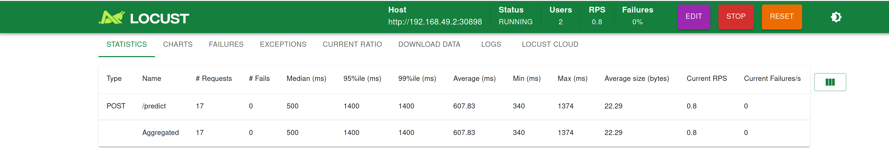
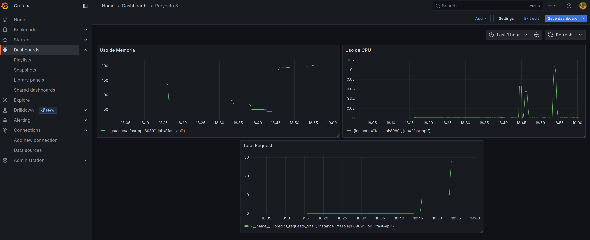

#           Desarrollo Proyecto 3   

Este repositorio contiene los archivos, configuraciones y recursos necesarios para desplegar un entorno completo de MLOps utilizando Kubernetes, integrando los servicios de Airflow, MLflow, Prometheus, Grafana, FastAPI y Streamlit. Este ecosistema robusto permite implementar un flujo de trabajo integral que abarca la ingesta, procesamiento, modelado, registro, despliegue y monitoreo de modelos de machine learning, todo gestionado y automatizado mediante DAGs orquestados con Airflow.

El proyecto forma parte del curso de Operaciones de Machine Learning de la Pontificia Universidad Javeriana y tiene como objetivo no solo encontrar el mejor modelo posible para el conjunto de datos propuesto (encuentros hospitalarios relacionados con diabetes en EE.UU. entre 1999 y 2008), sino también diseñar e implementar una arquitectura moderna que refleje las mejores prácticas de MLOps, poniendo énfasis en la trazabilidad, el versionamiento, la automatización y la escalabilidad.

El flujo del proceso incluye:

*   La recolección e ingestión de datos mediante pipelines controlados por Airflow.

*   El almacenamiento de datos en bases especializadas.

*   El preprocesamiento y entrenamiento periódico de modelos.

*   El registro automático de los resultados en MLflow.

*   La selección y publicación automática del modelo óptimo al entorno de producción.

*   El consumo del modelo en línea a través de una API desarrollada en FastAPI.

*   La exposición de resultados al usuario final mediante una interfaz interactiva construida con Streamlit.

*   Y la integración de herramientas de monitoreo como Prometheus y Grafana, junto a pruebas de carga con Locust, para garantizar la resiliencia y desempeño del sistema en condiciones reales de operación.

La entrega final incluye el código fuente en un repositorio público, el despliegue funcional sobre Kubernetes, y una sustentación en video explicando la arquitectura, los procesos implementados y las métricas obtenidas, demostrando así la capacidad del sistema para operar como un flujo MLOps completamente automatizado y trazable.

---

##          Estructura del Directorio

A continuación presentamos la estructura del directorio del proyecto, donde organizamos los diferentes objetos y elementos necesarios para el despliegue de todos los servicios, usando inicialmente **Docker** para crear la arquitectura base y realizar nuestras primeras pruebas, y luego, mediante el uso de Kompose traducir los scripts en los respectivos manifiestos para desplegar **Kubernetes**

También se recalca la necesidad de haber realizado el escrito de 3 `docker-compose`, con el objetivo de poder desplegar `aiflow`, `jupyterlab` y el resto de los servicios, esto con el propósito de poderlos traducir y llevar a Kubernetes. 

```plaintext
📁 PROYECTO3
├── 📁 airflow 
│   ├── 📄 Dockerfile
│   └── 📄 requirements.txt
├── 📁 app 
│   ├── 📄 Dockerfile
│   ├── 📄 main.py
│   └── 📄 requirements.txt
├── 📁 dags 
│   ├── 📄 cleandata_pipeline.py
│   ├── 📄 insert_rawdata_init.py
│   └── 📄 modeling.py
├── 📁 data 
│   └── 📄 Diabetes.csv
├── 📁 images                                   #   Imagenes
├── 📁 initdb 
│   ├── 📄 01_schemas.sql
│   └── 📄 Dockerfile
├── 📁 jupyter 
│   ├── 📄 ProfileReport_2025-04-30_diabetes_class.html
│   ├── 📄 dockerfile
│   ├── 📄 penguins_size.csv
│   ├── 📄 pruebas.ipynb
│   ├── 📄 pruebas2.ipynb
│   └── 📄 requirements.txt
├── 📁 kompose 
│   ├── 📄 fast-api-deployment.yaml 
│   ├── 📄 fast-api-service.yaml 
│   ├── 📄 grafana-deployment.yaml 
│   ├── 📄 grafana-service.yaml 
│   ├── 📄 locust-deployment.yaml 
│   ├── 📄 locust-service.yaml 
│   ├── 📄 minio-deployment.yaml 
│   ├── 📄 minio-service.yaml 
│   ├── 📄 minio-data-persistentvolumeclaim.yaml 
│   ├── 📄 mlflow-deployment.yaml 
│   ├── 📄 mlflow-service.yaml 
│   ├── 📄 mlops-postgres-deployment.yaml 
│   ├── 📄 mlops-postgres-service.yaml 
│   ├── 📄 postgres-mlflow-persistentvolumeclaim.yaml
│   ├── 📄 prometheus-configmap.yaml 
│   ├── 📄 prometheus-deployment.yaml 
│   ├── 📄 prometheus-service.yaml 
│   ├── 📄 streamlit-deployment.yaml 
│   └── 📄 streamlit-service.yaml 
├── 📁 locust 
│   ├── 📄 Dockerfile
│   ├── 📄 locustfile.py
│   └── 📄 requirements-locust.txt 
├── 📁 mlflow 
│   └── 📄 Dockerfile
├── 📁 streamlit 
│   ├── 📄 Dockerfile
│   ├── 📄 requirements.txt
│   └── 📄 streamlit_app.py
├── 📄 .env 
├── 📄 README.md 
├── 📄 docker-compose-airflow.yaml 
├── 📄 docker-compose-jupyter.yaml 
├── 📄 docker-compose-kubernete.yaml 
├── 📄 docker-compose-resto-back.yaml 
└── 📄 prometheus.yml 
```

Esta organización modular permite una gestión eficiente de cada componente del flujo de datos y facilita la escalabilidad del entorno.

##          Primera Fase (Despliegue por Docker)

Como primer pase del proceso de despliegue, realizamos todo el levantamiento inicial de los servicios utilizando **Docker**, ya que esto nos permite validar en un entorno controlado que las imágenes construidas funcionan correctamente antes de trasladarlas a un entorno más complejo como **Kubernetes**. De esta forma, aseguramos que cada contenedor tiene el comportamiento esperado y que las dependencias entre servicios están resueltas.

###         Paso 1: Crear Red Compartida    

Primero creamos una red interna en Docker que permitirá que todos los servicios definidos en los distintos docker-compose se comuniquen entre sí:

```bash
sudo docker network create airflow_backend
```

Esta red se usará para interconectar los servicios como Airflow, PostgreSQL, MLflow, Streamlit y otros, garantizando que puedan referenciarse por nombre de contenedor.

###         Paso 2: Desplegar Airflow   

Airflow es el orquestador central del pipeline. Su despliegue incluye también la base de datos PostgreSQL para almacenar metadatos de ejecución. Iniciamos el servicio con los siguientes comandos:

```bash
sudo docker compose -f docker-compose-airflow.yaml up airflow-init
sudo docker compose -f docker-compose-airflow.yaml up --build -d
```

El primer comando (airflow-init) prepara la base de datos y las configuraciones iniciales. El segundo comando levanta los contenedores en modo desacoplado (-d) y reconstruye las imágenes si es necesario (--build).

###         Paso 3: Desplegar servicios complementarios

Una vez Airflow está en ejecución, procedemos a levantar todos los servicios adicionales definidos para el entorno MLOps (MLflow, Prometheus, Grafana, FastAPI, Streamlit, etc.) con:

```bash
sudo docker compose -f docker-compose-resto-back.yaml up --build -d
```

Esto asegura que todos los servicios estén disponibles y accesibles dentro de la red Docker.

###         Paso 4: Desplegar JupyterLab (Opcional)

Si queremos habilitar un entorno interactivo para exploración, desarrollo y prueba de código, podemos desplegar JupyterLab:

```bash
sudo docker compose -f docker-compose-jupyter.yaml up --build -d
```

Este contenedor nos permite conectarnos a los datos y servicios ya levantados para realizar pruebas manuales o análisis exploratorio.

###         Bajar Servicios 

En caso de necesitar apagar o reconstruir los servicios, usamos los siguientes comandos para derribar los entornos específicos, eliminando también las imágenes y volúmenes asociados:

```bash
sudo docker compose -f docker-compose-airflow.yaml down --rmi all -v        # Para bajar airflow
sudo docker compose -f docker-compose-resto-back.yaml down --rmi all -v      # Para bajar servicios complementarios
sudo docker compose -f docker-compose-jupyter.yaml down --rmi all -v        # Para bajar jupyterlab
```

###         Revisión del Estado y Exposición de los Servicios   

Una vez levantados todos los servicios mediante Docker, iniciamos la etapa de revisión para asegurarnos de que cada componente se está ejecutando correctamente y es accesible desde los puertos configurados en `localhost`.

Podemos validar la exposición accediendo desde un navegador web a las siguientes direcciones:

```bash 
http://localhost:8989       # fastapi
http://localhost:8501       # streamlit
http://localhost:3000       # grafana
http://localhost:5000       # mlflow
http://localhost:9090       # promehteus
http://localhost:9001       # minio
http://localhost:8888       # jupyter
```

Es importante comprobar que al acceder a cada uno de estos endpoints, los servicios levantan sus respectivas interfaces y que no presentan errores de conexión, tiempo de espera o conflictos de puerto. Este paso asegura que la arquitectura montada en Docker funciona como se espera antes de avanzar al despliegue en Kubernetes.


###         Ejecución de los pipelines y validación de la arquitectura  

Una vez verificado que los servicios están correctamente expuestos, continuamos con la configuración inicial de los componentes internos para asegurar que toda la arquitectura está funcionando de manera integrada.

Primero, ingresamos al endpoint de MinIO (http://localhost:9001) y creamos un bucket llamado `mlflows3`. Este bucket será utilizado como almacenamiento de artefactos por MLflow, permitiendo guardar los modelos entrenados y sus recursos asociados.

A continuación, accedemos al panel de Airflow (http://localhost:8080) para iniciar manualmente la ejecución de los DAGs encargados de orquestar el flujo de datos y modelos. Para este proceso inicial, simplemente activamos los DAGs haciendo clic en el interruptor correspondiente en la interfaz, asegurándonos de que cada ejecución finalice de manera exitosa antes de pasar al siguiente.

Los DAGs que deben ejecutarse en este orden son:

- raw_data_initial_batch_load: Carga inicial de los datos crudos en la base de datos, y la marcación de train, valid y test

- clean_data_pipeline: Limpieza de los datos cargados.

- model_training_pipeline: Generación del pipeline de los datos, selección de variables, entrenamiento y registro del mejor entrenamiento.

Al completar la ejecución de estos tres DAGs, habremos preparado el flujo inicial: los datos han sido procesados, el modelo entrenado ha sido registrado en MLflow y sus artefactos almacenados en MinIO.

Posteriormente, validamos el consumo del modelo accediendo al endpoint de FastAPI (http://localhost:8989), enviando una solicitud de inferencia y comprobando que efectivamente la API está utilizando el modelo registrado como Production en MLflow.

Finalmente, procedemos a validar la integración de Locust con la API de FastAPI, asegurándonos de que las pruebas de carga se ejecuten correctamente sobre el endpoint de inferencia. En paralelo, verificamos que Prometheus y Grafana están conectados y recolectando métricas en tiempo real, lo cual nos permitirá monitorear el rendimiento y el estado de la API dentro del ecosistema desplegado en Docker.

Con estos pasos completados, confirmamos que los servicios están correctamente interconectados, funcionales y listos para su transición al despliegue sobre Kubernetes.


##          Segunda Fase (Despliegue por Kubernetes)

Para esta fase del proyecto, y considerando la complejidad que implica desplegar Airflow completamente sobre Kubernetes, se tomó la decisión de mantener el despliegue de Airflow y su base de datos asociado (PostgreSQL) mediante Docker.

Esta elección se debe a que Airflow no permite, de manera sencilla y sin configuraciones adicionales avanzadas, conectarse a una base de datos externa de PostgreSQL (la misma que utilizamos para almacenar tanto los datos raw como clean). Por este motivo, optamos por mantener la base de datos y Airflow dentro del mismo entorno de Docker, asegurando la compatibilidad y simplificando la gestión de conexiones y persistencia de datos en esta etapa.

El resto de los servicios de la arquitectura —incluyendo FastAPI, MLflow, Streamlit, Locust, Prometheus, Grafana y MinIO— se migraron a Kubernetes mediante la elaboración de los manifiestos necesarios. Para facilitar esta transición y acelerar el proceso, utilizamos la herramienta Kompose para convertir los archivos docker-compose en manifiestos compatibles con Kubernetes.

De esta manera, logramos un entorno híbrido, donde Airflow continúa funcionando en Docker, mientras que el resto de los componentes opera sobre Kubernetes, manteniendo la interoperabilidad entre ambos entornos mediante redes y endpoints expuestos.


###         Construcción de imágenes

Un requisito previo indispensable para la implementación en Kubernetes es que todas las imágenes de los servicios estén previamente construidas y publicadas en un repositorio accesible, en este caso Docker Hub.

El proceso seguido fue:

1.  Construcción local de las imágenes usando los Dockerfile correspondientes.

2.  Publicación (push) de las imágenes en Docker Hub bajo el usuario sebs1996.

3.  Actualización de los manifiestos de Kubernetes para referenciar las imágenes remotas en lugar de las construcciones locales.

Los comandos utilizados para cada servicio fueron los siguientes:

-   **fast-api**
```bash
docker build -t sebs1996/fastapi-mlops-p3:latest ./app
docker push sebs1996/fastapi-mlops-p3:latest
```

-   **mlflow**
```bash
docker build -t sebs1996/mlflow-mlops-p3:latest ./mlflow
docker push sebs1996/mlflow-mlops-p3:latest
```


-   **jupyter**
```bash
docker build -t sebs1996/jupyter-mlops-p3:latest ./jupyter
docker push sebs1996/jupyter-mlops-p3:latest
```

-   **streamlit**
```bash
docker build -t sebs1996/streamlit-mlops-p3:latest ./streamlit
docker push sebs1996/streamlit-mlops-p3:latest
```

-   **locust**
```bash
docker build -t sebs1996/locust-mlops-p3:latest ./locust
docker push sebs1996/locust-mlops-p3:latest
```

-   **airflow**
```bash
docker build -t sebs1996/airflow-mlops-p3:latest ./airflow
docker push sebs1996/airflow-mlops-p3:latest
```

**Nota:** Aunque construimos y publicamos la imagen de Airflow para fines de versionamiento y control, su despliegue operativo final permanece ejecutándose en Docker y no dentro del clúster de Kubernetes.


###         Configuración de NodePort

Para permitir la comunicación externa con los servicios expuestos en el clúster de Kubernetes, es necesario configurar los servicios como NodePort. Esto asegura que los puertos estén accesibles desde fuera del clúster a través de la IP del nodo.

Esta configuración se realiza desde el archivo docker-compose, agregando una etiqueta dentro de labels con el valor kompose.service.type: nodeport en cada servicio que se desee exponer externamente.

A continuación, se muestra un ejemplo de esta configuración aplicada al servicio FastAPI:

<div align="center">  </div>


###         Generación de manifiestos con Kompose.

Luego de verificar el correcto funcionamiento de la arquitectura en Docker, se procede a generar los manifiestos necesarios para el despliegue en Kubernetes. Este paso convierte las definiciones de docker-compose en archivos YAML compatibles con Kubernetes, utilizando la herramienta Kompose.

Los manifiestos generados se almacenan en la carpeta /kompose del repositorio:

```bash
kompose -f docker-compose-kubernete.yaml convert -o kompose/
```

De esta forma, cada servicio, volumen y red definidos en Docker Compose se traduce a sus equivalentes en Kubernetes, permitiendo replicar la arquitectura en el clúster.


###         Configuración de volúmenes y archivos locales

En Kubernetes, la gestión de volúmenes y archivos de configuración difiere de Docker. Es necesario convertir archivos locales en manifiestos que representen recursos de Kubernetes.

Un ejemplo clave es la configuración de **Prometheus**. El archivo prometheus.yml, utilizado por Prometheus para definir sus jobs y targets, debe transformarse en un ConfigMap que **Kubernetes** pueda montar en el contenedor. Esto se logra con el siguiente comando:

```bash
kubectl create configmap prometheus-config --from-file=prometheus.yml=.\prometheus.yml --dry-run=client -o yaml > prometheus-configmap.yaml
```

Este manifiesto *prometheus-configmap.yaml* se ubica en la carpeta /kompose y luego se referencia dentro del manifiesto prometheus-deployment.yaml. Allí se actualiza la sección de volumes y volumeMounts para montar el ConfigMap dentro del contenedor de Prometheus, garantizando que cargue correctamente el archivo de configuración en tiempo de ejecución.

A continuación, se muestra la configuración del despliegue de Prometheus con el volumen montado:

<div align="center">  </div>


###         Configuración de los Puertos 

Por defecto, cuando se despliega un servicio en Kubernetes utilizando el tipo NodePort, el clúster asigna automáticamente un puerto dentro del rango 30000 – 32767. Sin embargo, dado que estos servicios serán consumidos externamente al clúster, es una buena práctica asignar manualmente un puerto específico para cada servicio. Esto permite estandarizar los accesos, documentar de forma clara las rutas y evitar asignaciones dinámicas que puedan variar entre despliegues.

Para lograr esta configuración, es necesario modificar los manifiestos relacionados a los Service de Kubernetes, especificando explícitamente el valor de nodePort que se desea utilizar. A continuación, se muestra un ejemplo aplicado al manifiesto del servicio FastAPI:

<div align="center">  </div>

La siguiente tabla resume los puertos asignados manualmente a cada servicio, indicando el puerto interno del contenedor y el NodePort expuesto por Kubernetes:

| **Servicio**        | **Puerto Contenedor**  | **Puerto Kubernetes**|     
|---------------------|------------------------|----------------------|                  
| **fast-api**        | 8989                   | 30898                |
| **grafan**          | 3000                   | 30300                |               
| **jupyter**         | 8888                   | 30888                |               
| **locust**          | 8089                   | 30808                |
| **minio**           | 9000                   | 30900                |
|                     | 9001                   | 30901                |
| **mlflow**          | 5000                   | 30500                |
| **mlops-postgres**  | 5432                   | 30543                |
| **prometheus**      | 9090                   | 30909                |
| **streamlit**       | 8501                   | 30850                |

 Con esta asignación, los servicios pueden ser accedidos de manera consistente a través de la dirección http://<IP_DEL_NODO>:<NodePort> en cualquier entorno donde se despliegue el clúster, facilitando las pruebas, monitoreo y consumo de las aplicaciones.


###         Inicialización del kubernetes

Para el despliegue local del clúster de Kubernetes se utilizó Minikube como entorno de ejecución. El primer paso consiste en iniciar un nuevo clúster local con el siguiente comando:

```bash
minikube start
```

La comunicación entre el clúster y los servicios externos se realiza mediante la IP del nodo de Minikube, la cual puede obtenerse con:

```bash
minikube ip
```
**Nota:** esta dirección IP será necesaria para acceder a los servicios expuestos mediante NodePort.

En caso de ser necesario eliminar el clúster y todos los recursos asociados, se ejecuta:

```bash
minikube delete
```

###         Despliegue de los Servicios  

Una vez el clúster de Kubernetes está activo y todos los manifiestos se encuentran ubicados en la carpeta *kompose/*, procedemos a desplegar todos los recursos definidos en los manifiestos con el comando:

```bash
kubectl apply -f kompose/
```

Esto aplicará la creación de los **Deployments**, **Services**, **ConfigMaps**, **PersistentVolumeClaims** y demás recursos necesarios para levantar la arquitectura en Kubernetes.

Para verificar que los servicios fueron creados correctamente y que están expuestos con los puertos declarados (usando `NodePort`), ejecutamos:

```bash
kubectl get services -A
```

La salida del comando nos permite confirmar:
-   Los nombres de los servicios.
-   El tipo de servicio (NodePort).
-   Los puertos internos y externos configurados.

<div align="center">  </div>

Posteriormente, validamos que los pods de cada servicio estén en ejecución sin errores, utilizando:

```bash
kubectl get pods
```

Esto nos asegura que las imágenes se descargaron correctamente y que los contenedores están corriendo dentro del clúster.

<div align="center">  </div>

-   Todos los pods deben mostrarse con el estado Running y sin reinicios recurrentes (RESTARTS).

En caso de ser necesario eliminar todos los recursos desplegados en el clúster, se puede ejecutar:

```bash
kubectl delete -f kompose/
```

##          Monitoreo 

###         Generación de Tráfico para Pruebas de Rendimiento

Una vez desplegados todos los servicios en el clúster de **Kubernetes** y confirmada la correcta ejecución de **Airflow**, es necesario generar tráfico hacia la API de **FastAPI** para activar la recolección de métricas en **Prometheus** y evaluar el desempeño de la plataforma bajo carga.

Existen dos formas principales para generar este tráfico:

**Streamlit** – útil para realizar pruebas manuales o demostraciones interactivas del modelo.

**Locust** – recomendado cuando se busca automatizar el envío de solicitudes y simular usuarios concurrentes de manera controlada.

Para este entorno se optó por Locust, configurándolo para emular **2 usuarios concurrentes**, cada uno realizando **1 solicitud por segundo** al servicio de FastAPI expuesto dentro del clúster de Kubernetes.

<div align="center">  </div>

Esta simulación permite someter la API a una carga constante, facilitando la recolección de métricas representativas sobre su rendimiento y estabilidad.


###         Visualización en Grafana

Mientras el tráfico de prueba se encuentra en ejecución, Prometheus recoge automáticamente las métricas expuestas por el servicio FastAPI a través del endpoint /metrics. Posteriormente, Prometheus es configurado como fuente de datos en Grafana, habilitando la creación de dashboards personalizados para monitorear el comportamiento del sistema en tiempo real.

En este caso, se diseñó el dashboard denominado “Proyecto 3”, donde se visualizan las métricas clave del servicio desplegado y del clúster de Kubernetes.

<div align="center">  </div>

Las principales métricas monitorizadas en el dashboard Proyecto 3 son:

-   **Total Requests**  
  Número acumulado de peticiones recibidas por la API.  
  Implementado como un contador que se incrementa cada vez que se ejecuta el método `predict` de FastAPI.

-   **Uso de memoria**  
  Métrica generada por defecto en `metrics`.  
  Mide cuánta memoria RAM está usando el proceso actualmente, expresada en megabytes (MB).
  Fue generada con la consulta `process_resident_memory_bytes / 1024 / 1024`

-   **Uso de CPU**  
  Métrica generada por defecto en `metrics`.  
  Calcula el promedio de segundos de CPU usados por segundo en el último minuto.
  Fue generada con la consulta `rate(process_cpu_seconds_total[1m])`

 Con estas métricas, se logra una visibilidad integral sobre la capacidad de respuesta de la API, permitiendo identificar cuellos de botella, validar la estabilidad del servicio y monitorear el uso de recursos del clúster.


##          Anexos  

###         Exploración y Análisis de los Datos

Como parte del proceso de validación y entendimiento de la fuente de datos, se utilizó el entorno de JupyterLab para examinar las tablas cargadas en la base de datos correspondiente al esquema raw_data. Mediante consultas directas y análisis descriptivos, se evaluó la estructura, las variables y los valores presentes en el conjunto de datos.

Durante esta etapa de análisis, se constató que el dataset cuenta con una excelente documentación y una codificación clara de las variables, lo que facilita su interpretación y uso en procesos de modelado. La fuente oficial del dataset es la base de datos pública alojada en el repositorio de UCI Machine Learning Repository, disponible en el siguiente enlace:

[Diabetes 130-US hospitals for years 1999-2008](https://archive.ics.uci.edu/dataset/296/diabetes+130-us+hospitals+for+years+1999-2008)

A partir de esta exploración inicial se concluyó que las principales acciones de preprocesamiento necesarias se concentran en:

Corrección de caracteres especiales en algunas columnas.

Tratamiento de valores nulos o faltantes en variables específicas.

Dado que no se identificaron problemas estructurales mayores ni inconsistencias graves, se decidió centrar los esfuerzos de limpieza en estos aspectos, para posteriormente cargar los datos procesados en el esquema clean_data, desde donde se alimentarán los pipelines de entrenamiento de modelos.

**Nota:** La documentación oficial del dataset resultó ser una fuente clave para entender las relaciones entre las variables, los códigos de diagnóstico y los significados de las categorías incluidas.