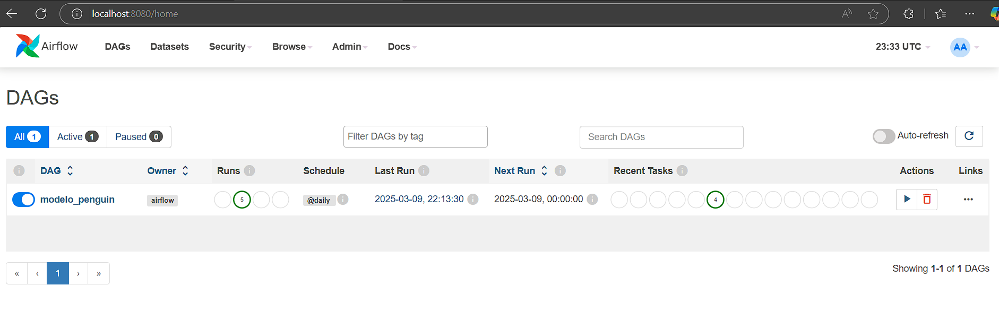
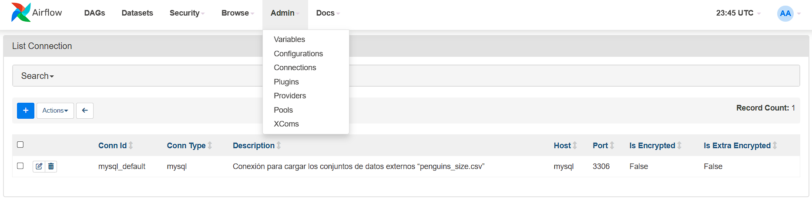
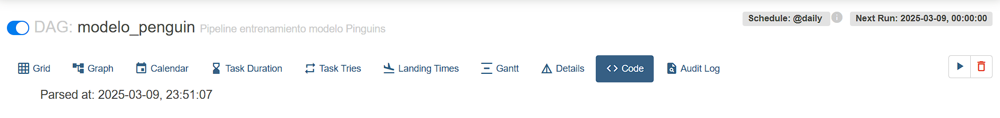
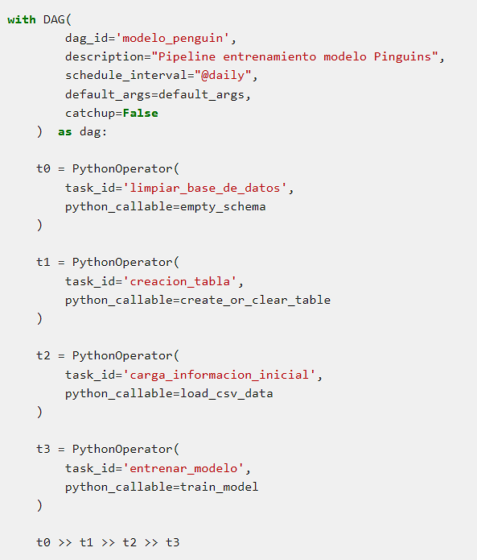
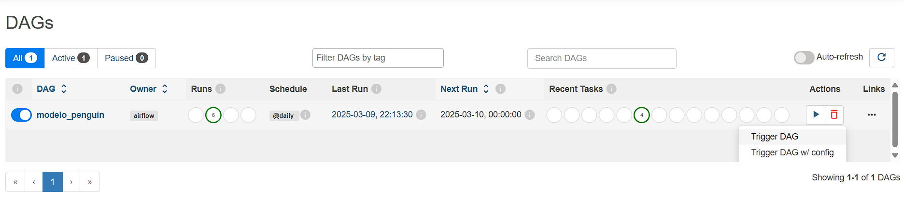

#       Desarrollo Taller Airflow

Este repositorio contiene los archivos y configuraciones necesarias para el despliegue de un entorno de **Apache Airflow**, diseñado para gestionar la ejecución de flujos de trabajo automatizados en el procesamiento de datos y entrenamiento de modelos de Machine Learning.

El **pipeline** implementado está estructurado mediante tasks definidas dentro de un **DAG** (**Directed Acyclic Graph**), asegurando una ejecución controlada y reproducible de cada etapa del proceso. El flujo inicia con la limpieza de la base de datos. Luego, se realiza la carga de información desde el archivo fuente hacia la base de datos. Posteriormente, los datos son preprocesados mediante la transformación y normalización de las variables, aplicando codificación a los atributos categóricos y escalando las variables numéricas mediante la normalización estándar. Una vez completada esta etapa, se lleva a cabo el entrenamiento del modelo utilizando un algoritmo de aprendizaje supervisado (Random Forest). Finalmente, se realiza la validación del modelo, evaluando su desempeño con el **accuracy** (precisión).

Las tareas descritas anteriormente están embebidas en tasks dentro del DAG de Airflow, permitiendo un control detallado sobre su ejecución y facilitando la trazabilidad del proceso.

##      Estructura del Directorio:

```plaintext
📁 taller_airflow 
|── 📁app                                       #   Carpeta donde se almacena los recursos para desplegar la API de inferencia
    |── 📄dockerfile                            #   Dockerfile para hacer la carga del ambiente para la API con FastAPI
    |── 📄main.py                               #   Archivo Python donde se almacena el código que se implementa la API
    |── 📄requirements.txt                      #   Dependencias para el despliegue de la API
|── 📁dags                                      #   Carpeta donde se almacenan los DAGS, además de almacenar la rawdata
    |── 📄penguins_size.csv                     #   Archivo para el experimento penguins_size.csv (rawdata)
    |── 📄proceso_modelo.py                     #   DAG del experimento
|── 📁images                                    #   Imagenes de soporte para el README.md
    |── 📄CodeDAG.png                     
    |── 📄DAG.png                     
    |── 📄NewConnection.png                     
    |── 📄TasksDAG.png                     
    |── 📄TriggerDAG.png                     
|── 📁logs                                      #   Almacen de los logs del experimento
|── 📁plugins                                   
|── 📄.env                                      #   Variable de entorno para lanzar Apache Airflow
|── 📄docker-compose.yaml                       #   Docker Compose que almacena el código para el despliegue del experimento
|── 📄dockerfile                                #   Dockerfile para cargar las dependencias necesarias (no se usar docker compose)
|── 📄README.md                                 
|── 📄requirements.txt                          #   Dependencias para el DAG
```

**Nota:** Otras carpetas y objetos son producto de la ejecución del experimento, por ende no se incluyen dentro de la estructura del directorio.

##      Requisitos Previos  

Antes de iniciar con el experimento, es necesario contar con una máquina con las siguientes condiciones:

-       Docker y Docker-Compose (para garantizar entornos reproducibles y aislados).

-       Un entorno de desarrollo o terminal compatible con Docker, como:

    -       VS Code (recomendado con la extensión Remote - Containers).

    -       PyCharm (con soporte para Docker).

    -       Cualquier terminal que permita la ejecución de Docker y la gestión de contenedores.

**Nota:** No se requieren requisitos adicionales, ya que el despliegue de Airflow mediante Docker Compose incluye una imagen preconfigurada con todos los recursos necesarios para la ejecución del DAG. Esto garantiza que Python y sus respectivas dependencias estén correctamente instaladas y disponibles en el entorno de ejecución, evitando conflictos de versiones y facilitando la portabilidad del sistema.

##      Proceso de Ejecución 

Para iniciar el entorno de Airflow, es fundamental mantener la estructura de directorios establecida durante el desarrollo del experimento. Esto incluye la correcta configuración de la variable de entorno almacenada en .env y la presencia de los directorios dags, logs y plugins, los cuales son esenciales para el funcionamiento adecuado del sistema.

Si estos directorios no existen, pueden ser creados manualmente o mediante el siguiente comando en VS Code, que fue el entorno utilizado para este desarrollo:

```Bash
mkdir dags, logs, plugins
echo "AIRFLOW_UID=50000" | Out-File -Encoding utf8 .env
```
**Nota:** Este comando asegura la creación de las carpetas requeridas y el archivo de configuración del entorno, permitiendo que Airflow se ejecute sin inconvenientes. Pero no recomendamos su ejecución si se clona este repositorio, pues se podría modificar el contenido que contiene la carpeta dags, y se perdería tanto la rawdata como el DAG del experimento.

Tomando en cuenta que los directorios dags, logs, y plugins ya existen, y que la variable de entorno requerida para iniciar Airflow ha sido correctamente definida, el procedimiento para desplegar Airflow se realiza ejecutando los siguientes comandos en la consola de la herramienta utilizada para reproducir este experimento:

```Bash
docker compose up airflow-init
docker compose up --build -d
```
El primer comando **docker compose up airflow-init** prepara el entorno de Airflow y sus dependencias antes de su ejecución. Una vez completada esta configuración, el segundo comando **docker compose up --build -d** ejecuta Airflow en segundo plano, permitiendo que los servicios corran de manera persistente sin bloquear la terminal y asegurando que la imagen creada este actualizada con las especificaciones proporcionadas en docker-compose.yaml.

Este procedimiento garantiza que Airflow se levante correctamente y esté listo para ejecutar el DAG definido para este experimento.

##      Dentro del DAG

Una vez iniciado Airflow, se accede a la interfaz de usuario a través del navegador ingresando la siguiente dirección:

```Bash
http://localhost:8080
```

Al ingresar, el sistema solicitará credenciales de acceso, las cuales están predefinidas de la siguiente manera:

-   Usuario: airflow

-   Contraseña: airflow

Esta interfaz permite visualizar, gestionar y monitorear los DAGs definidos en Airflow, así como revisar los registros de ejecución de cada tarea, modificar configuraciones y ejecutar manualmente los flujos de trabajo según sea necesario.

Dentro de la interfaz, se encontrará el **DAG** denominado **modelo_penguin**, el cual ha sido diseñado para ejecutar el pipeline descrito previamente. Este DAG orquesta las distintas fases del proceso, asegurando la correcta ejecución de la limpieza de la base de datos, carga de información, preprocesamiento, entrenamiento y validación del modelo.



Antes de ejecutar el DAG, es necesario configurar una nueva conexión en Airflow, la cual debe apuntar al motor de base de datos **MySQL**, que se encuentra ejecutándose como un servicio dentro de **Docker Compose**.

Para realizar esta configuración, dentro de la interfaz de Airflow, se debe seguir el siguiente procedimiento:

-   Ir al menú Admin > Connections.

-   Hacer clic en el ícono + para agregar una nueva conexión.

-   Completar los campos con los parámetros de la base de datos MySQL definida en el archivo docker-compose.yml.

Esta configuración es crucial, ya que Airflow necesita esta conexión para interactuar con la base de datos y ejecutar correctamente las tareas de carga, preprocesamiento y almacenamiento de resultados.



La lista de parámetros para generar la nueva conexión son: 

-   Connection Id: mysql_default

-   Connection Type: MySQL

-   Description: Conexión para cargar los conjuntos de datos externos “penguins_size.csv”

-   Host: mysql

-   Schema: mydatabase

-   Login:  mysqluser

-   Password: airflow

-   Port: 3306

Una vez configurados los parámetros de conexión, es necesario realizar una prueba de conectividad para asegurarse de que Airflow puede establecer comunicación con la base de datos MySQL.

Para ello, dentro del formulario de configuración de la conexión en Airflow, se debe hacer clic en el botón "Test". Si la conexión es exitosa, se mostrará un mensaje de confirmación.

Después de haber aprobado la prueba, procedemos a guardar la conexión, asegurando que estará disponible para su uso dentro del DAG modelo_penguin y otros flujos de trabajo que requieran acceso a la base de datos.

Para acceder al código fuente del DAG compilado, debemos regresar a la página principal de Airflow, en la sección DAGs.

-   Ubicar el DAG modelo_penguin dentro de la lista de DAGs.

-   Hacer clic sobre el nombre del DAG para ingresar a su vista detallada.

-   Navegar a la pestaña <> Code, donde se mostrará el código fuente del DAG cargado en el entorno de Airflow.

Desde esta vista, es posible inspeccionar la implementación del DAG, revisar la estructura de sus tasks y validar su configuración antes de su ejecución.



En el código del DAG, se pueden observar cuatro funciones principales que gestionan todo el proceso del pipeline, asegurando la ejecución estructurada de cada etapa.

1.   Borrado del esquema: Se encarga de eliminar por completo el esquema utilizado en la base de datos, garantizando que el entorno esté limpio antes de cada ejecución.

2.  Creación de la tabla para la rawdata: Genera la estructura necesaria en la base de datos para almacenar la información externa en su estado original.

3.  Carga de la rawdata: Inserta los datos en la tabla creada, permitiendo su posterior transformación y análisis.

4.  Preprocesamiento, entrenamiento y validación del modelo: Aplica las transformaciones necesarias a los datos, entrena un modelo de aprendizaje supervisado y realiza su evaluación. En esta etapa, el modelo entrenado es serializado y almacenado en un archivo **.pkl**, lo que permite su reutilización y facilita su integración con una **API** en **FastAPI** para realizar predicciones en tiempo real.

Este flujo de trabajo permite la ejecución automatizada del pipeline y garantiza la trazabilidad de cada fase, asegurando la reproducibilidad de los resultados.



Para ejecutar completamente el DAG, podemos regresar a la página principal de Airflow, en la pestaña DAGs, y localizar el DAG modelo_penguin dentro de la lista de DAGs disponibles.

Una vez identificado, hacemos clic en la acción **"Trigger DAG"**, lo que iniciará la ejecución secuencial de todas las tasks del pipeline. Esto permitirá que el proceso de borrado del esquema, creación de la tabla, carga de datos, preprocesamiento, entrenamiento y validación del modelo se lleve a cabo de manera automatizada.

Al finalizar la ejecución, el modelo estará disponible y almacenado como un archivo .pkl, listo para ser utilizado mediante la API desarrollada en FastAPI.



##      Uso de la API

Para hacer uso de la API de FastAPI, accedemos a través del navegador ingresando la siguiente dirección:

```Bash
http://localhost:8989
```

Esto nos mostrará la interfaz generada automáticamente por FastAPI, donde se encuentran documentados los métodos GET y POST disponibles.

-   **Método GET**: Permite rastrear y verificar el modelo entrenado por el DAG, asegurando que esté correctamente almacenado y disponible para su uso.

-   **Método POST**: Facilita el envío de datos al modelo para realizar predicciones, utilizando el modelo previamente entrenado y serializado en el pipeline de Airflow.

En esta fase, retomamos el experimento previo en el que se desarrolló una API para el despliegue y uso de modelos entrenados con la librería Scikit-Learn, asegurando que el flujo de trabajo implementado en Airflow pueda integrarse de manera eficiente con este servicio.

##  Aclaraciones del Código

Para el desarrollo de este experimento, nos apoyamos en los recursos proporcionados por el profesor, adaptando la configuración de Docker Compose para incluir un servicio de MySQL, sin modificar ni eliminar el servicio de PostgreSQL, que mantiene su conexión con Airflow para su correcta inicialización.

Además, se integró un servicio de FastAPI, permitiendo la utilización del modelo entrenado en el DAG para realizar predicciones en tiempo real. También se agregó un volumen persistente para garantizar el correcto uso de MySQL como base de datos externa, asegurando la persistencia de los datos durante el desarrollo del experimento.

A lo largo del código, se han incluido comentarios que detallan cada paso en la construcción del experimento, facilitando su comprensión y reproducción.