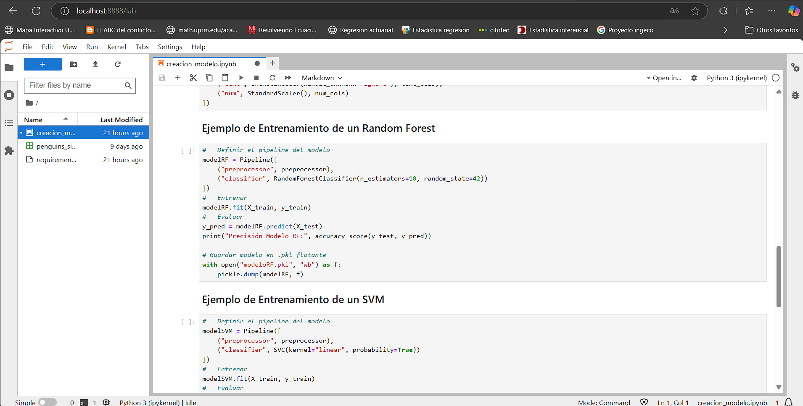

#   Segundo Taller Operación Aprendizaje de Máquina 

La presente carpeta se encuentra el desarrollo del taller propuesto en la asignatura de MLOPS - Desarrollo de Contenedores. En este taller se propone la integración de **UV** en un proyecto con **Docker Compose**, donde el propósito es poder integrar UV en este entorno para gestionar las dependencias de manera más eficiente.

La idea del ejercicio es crear una instancia de **JupyterLab** instalada con **UV** y otra instancia generada en este caso con **FastAPI**, las cuales compartan un volúmen persistente, en el cual se deben alojar los modelos guardados a traves de la instancia de **JupyterLab**, y poder ser utilizados a necesidad del usuario por medio de la instancia de la **API**. El diagrama del ejercicio se puede ver a continuación.


##  Uso de la Herramienta

Para desplegar la herramienta, es imprescindible ubicarse en la terminal dentro del directorio donde se encuentra el archivo docker-compose.yaml. Una vez en la ruta correcta, ejecute el siguiente comando:

```Bash
docker-compose up -d
```

Tras el despliegue de los contenedores, se podrá acceder a la interfaz de JupyterLab mediante la dirección **localhost:8888/lab** en el navegador. Esta interfaz está diseñada para facilitar el desarrollo de modelos por parte de científicos de datos, permitiendo su posterior integración con la **API** desplegada. Como referencia, se proporciona el notebook **creacion_modelo.ipynb**, en el cual se ilustra el proceso de desarrollo y almacenamiento de dos modelos: Random Forest y Support Vector Machine (SVM), con el objetivo de disponibilizarlos en la **API**. Por favor ejecutar todas las celdas del notebook para disponibilizar los modelos en el volúmen.



Una vez entrenados y almacenados los modelos en la interfaz de JupyterLab, estos quedarán guardados en el volumen configurado, lo que permitirá su uso directo por parte de la **API**. La documentación de la **API** está disponible en el navegador a través de la dirección **localhost:8989/docs**, donde se describen dos métodos principales:

1.  **listar_modelos**: Método **GET** que permite obtener los nombres de los modelos almacenados en el volúmen.


2.  **predict**: Método **POST** que permite realizar predicciones utilizando un modelo previamente almacenado (seleccionado de la lista obtenida en el primer método). Para ello, es necesario proporcionar un conjunto de variables predefinidas.


**NOTA**: El usuario tiene la posibilidad de desarrollar cualquier otro modelo de su elección. En este caso, el científico de datos podrá utilizar la misma base de desarrollo, **penguin_size.csv**, siempre que emplee la librería **scikit-learn** para el entrenamiento de los modelos y los almacene en formato **pickle** (.pkl).
