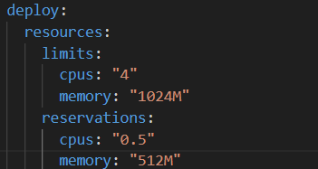
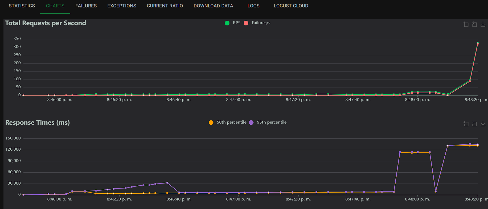
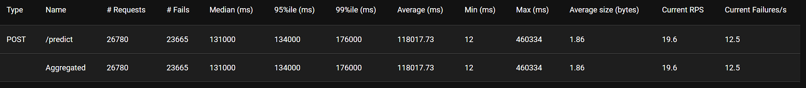
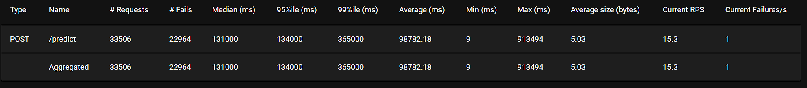

#       Taller Locust


Este taller retoma el Proyecto 2 previamente desarrollado, con una pequeña modificación: en esta etapa, no utilizaremos Streamlit como parte de la solución. Todo lo demás (resultados con respecto al entrenamiento del modelo) permanece tal como fue concebido en el proyecto base.

A lo largo del taller, realizaremos el despliegue de nuestra API de inferencia utilizando Docker, publicaremos imágenes en Docker Hub, conectaremos redes manualmente para establecer comunicación entre servicios, y finalmente ejecutaremos pruebas de carga con Locust. También exploraremos la escalabilidad del sistema desplegando múltiples réplicas usando Docker Swarm, con el objetivo de evaluar el rendimiento de la arquitectura.

##      Publicación de Imagen en DockerHub 

Para facilitar el despliegue en diferentes entornos y garantizar portabilidad, iniciamos exportando nuestra imagen de FastAPI para inferencia y publicándola en Docker Hub. Esto nos permitirá reutilizar la imagen en distintos nodos o contextos sin necesidad de reconstruirla localmente. (Publicamos la imagen ya construida en el proyecto 2).

Antes de proceder, nos aseguramos de estar autenticados en Docker Hub mediante el siguiente comando:

```bash
sudo docker login
```

Verificamos qué imágenes están disponibles en nuestro sistema para asegurarnos del nombre exacto que queremos etiquetar:

```bash
sudo docker ps -a
```

Una vez identificada la imagen correspondiente al servicio de inferencia, la etiquetamos con un nombre que facilite su publicación:

```bash
sudo docker tag proyecto2-fast_api:latest blutenherz/repo_inference_p2:inference_p2
```

Publicamos la imagen etiquetada directamente en nuestro repositorio:

```bash
sudo docker push blutenherz/repo_inference_p2:inference_p2
```

La imagen publicada puede consultarse en el siguiente enlace:

```bash
https://hub.docker.com/repository/docker/blutenherz/repo_inference_p2/tags
```


##      Despliegue de la Api de Inferencia  

Con la imagen ya disponible en Docker Hub, podemos levantar el servicio de inferencia en cualquier equipo simplemente utilizando docker-compose y apuntando a la imagen publicada.
```bash
sudo docker compose -f docker-compose-inference.yaml up --build -d
```

Para detener el servicio y eliminar los volúmenes y recursos asociados, usamos:

```bash
sudo docker compose -f docker-compose-inference.yaml down -v --rmi all
```

##      Conexión Manual a la Red del Proyecto   

Una vez desplegado el servicio de inferencia, necesitamos conectarlo a la red del Proyecto 2, ya que este entorno fue levantado anteriormente y es donde residirá el resto de los servicios.

Listamos las redes activas para identificar el bridge correspondiente al entorno de trabajo:

```bash
sudo docker network ls
```

Luego conectamos el contenedor de inferencia a la red de proyecto2_default:
```bash
sudo docker network connect proyecto2_default inference
```

Para verificar que el servicio está corriendo correctamente, podemos acceder a la documentación automática generada por FastAPI en:
```bash 
http://localhost:8000/docs
```


##      Pruebas de Carga con Locust 

Para evaluar el rendimiento de nuestra API de inferencia, utilizaremos Locust, una herramienta para realizar pruebas de carga y estrés.

Hacemos el levantamiento del servicio de Locust por medio del siguiente comando:
```bash
sudo docker compose -f docker-compose-locust.yaml up --build -d
```

Para poder eliminar Locust y dejar en limpio los residuos posbiles ejecutamos el siguiente comando:
```bash
sudo docker compose -f docker-compose-locust.yaml down -v --rmi all
```

Una vez iniciado el servicio, accedemos a la UI de Locust para configurar la prueba:
```bash
http://localhost:8089
```

##      Conexión Manual para Pruebas

Para permitir que Locust se comunique directamente con el servicio de inferencia, los conectamos mediante una red externa compartida:
```bash
sudo docker network create testnet
sudo docker network connect testnet inference
sudo docker network connect testnet locust
```

##      Análisis Inicial de Rendimiento 

Como primera aproximación, ejecutamos una prueba con 10,000 usuarios simulados, aumentando la carga de manera progresiva en pasos de 500. Los recursos asignados inicialmente a la API fueron limitados y representados así:



Los resultados de la prueba evidenciaron una demora considerable en las respuestas. Al eliminar las restricciones de CPU y memoria, la situación no mejoró, lo cual nos llevó a una inspección más detallada del código de la API.





**Hallazgo Clave**

Identificamos que la función predict dentro de FastAPI es el principal cuello de botella. Esto se debe a que en cada llamada:

-   Se realiza la carga del modelo desde el bucket en MinIO.

-   Se consulta el registro en MLflow.

Estas operaciones son costosas y se repiten innecesariamente para cada solicitud. Una mejora inmediata sería persistir el modelo en memoria, cargándolo al iniciar el servicio y utilizandolo dentro del post (función predict), eliminando así la sobrecarga en cada invocación.

**Nota:** Hacemos aclaración que este error es la principal causa que evita el rendimiento óptimo para la api, por este motivo lo dejamos como tarea para futuros desarrollos que requieran del uso de la API.


##      Escalabilidad con Docker Swarm  

Dado que aumentar los recursos no resolvió el problema, decidimos probar con múltiples réplicas del servicio utilizando Docker Swarm, con el fin de distribuir la carga entre instancias paralelas.

**Archivos Utilizados**

-   docker-compose-inference-swarm.yaml
-   docker-compose-locust-mod.yaml

Primero preparamos el entorno de desarrollo, para ello primero creamos el network overlay para conectar las replicas de la api de inferencia con el siguiente comando:
```bash
sudo docker network create --driver overlay --attachable internal_net
```

En dado caso si se require eliminar el network se puede hacer de la siguiente manera:
```bash
sudo docker network rm internal_net
```

Luego inicializamos el Docker Swarm para levantar el servicio con réplicas con:
```bash
sudo docker swarm init
```

Ya teniendo el entorno listo para el levantamiento del servicio por réplicas, hacemos el despliegue con el siguiente comando:
```bash
sudo docker stack deploy -c docker-compose-inference-swarm.yaml p2_inference
```

En dado caso que se requiera dar de baja al docker stack se hace con el siguiente comando:
```bash
sudo docker stack rm p2_inference
```

Luego de realizar el levantamiento del docker stack con los siguiente comandos:
```bash
sudo docker service ls
sudo docker service ps p2_inference_inferencia
```

Ahora, seguimos con el levantamiento del servicio de Locust con el siguiente comando, el docker compose modificado tiene la nueva URL para la correcta interpretación del DNS dentro de docker, y poder utilizar este servicio de manera efectiva.
```bash
sudo docker compose -f docker-compose-locust-mod.yaml up --build -d
```

En caso de requerir para dar de baja el servicio de Locust se hace con el siguiente comando:
```bash
sudo docker compose -f docker-compose-locust-mod.yaml down -v --rmi all
```

El siguiente paso consiste en conectar los contenedores creados por Docker Swarm al bridge del proyecto 2, para la respectiva lectura del modelo entrenado. Para este proceso iniciamos en identificar los ID de los contenedores generados:
```bash
sudo docker ps --filter "name=p2_inference_inferencia" -q
```

Luego conectamos cada contenedor al network overlay mediante el siguiente comando, para cada uno de los ID identificados
```bash
sudo docker network connect proyecto2_default < id_contenedor >
```
⚠️ Este proceso puede automatizarse mediante un script.

Luego de haber conectado las replicas de la API, conectamos Locust a la network para que pueda hacer uso de los contenedores generados por Docker Swarm.
```bash
sudo docker network connect internal_net locust
```

Podemos revisar la configuración del network overlay que efectivamente esten conectados el docker stack con locust para hacer su respectivo consumo.

```bash 
sudo docker network inspect internal_net
```


Durante las pruebas, experimentamos una reducción progresiva en los recursos asignados a cada réplica del servicio de inferencia, observando que el rendimiento del sistema se mantenía estable a pesar de estas limitaciones. Esto sugiere que la arquitectura basada en réplicas tolera una disminución de recursos sin afectar negativamente la capacidad de respuesta. No obstante, también es importante considerar que nuestra API aún no está optimizada para entornos de producción, por lo que los resultados podrían variar al compararse con una implementación más eficiente y estructurada.

Finalmente, la estrategia de escalado horizontal mediante réplicas demostró una mejora significativa en el rendimiento del sistema. Si bien la restricción individual de recursos no mostró beneficios evidentes, al combinar réplicas múltiples con asignaciones más modestas, se logra un equilibrio entre rendimiento y eficiencia en el uso de recursos. Esta combinación permite mejorar la capacidad de respuesta del sistema sin incurrir en un sobreconsumo innecesario, lo cual representa una estrategia prometedora para despliegues en ambientes productivos o con recursos limitados.



