#       Desarrollo Taller MLFlow

Este repositorio incluye los archivos y configuraciones esenciales para el despliegue de un entorno **MLflow**, una plataforma diseñada para la gestión integral del ciclo de vida de modelos de aprendizaje automático (ML), incluyendo el seguimiento de experimentos, la administración de modelos y su despliegue en producción.

Este repositorio simula un entorno de conectividad en la nube, estableciendo la comunicación entre diferentes servicios o instancias a través de puertos específicos. A lo largo del código, se incluyen referencias a la dirección IP de la máquina anfitriona donde se ejecuta el entorno. Sin embargo, este ajuste no es estrictamente necesario, ya que el despliegue se ha diseñado con un enfoque estricto en Docker, garantizando que todos los servicios se ejecuten en contenedores sin depender directamente del host.

En caso de requerir la integración con un servicio externo o alojado fuera de Docker, la configuración de conectividad puede ajustarse directamente en el código según sea necesario, permitiendo la comunicación con servicios que no formen parte del entorno contenedorizado.

Las direcciones IP de los integrantes del grupo pueden variar según la máquina virtual en la que se esté desplegando el entorno. A continuación, se listan las IP asignadas a cada miembro:

-   Julio Roa: 10.43.101.192

-   Sebastián Saavedra: 10.43.101.197

Es importante considerar estas direcciones al configurar la conectividad con servicios externos o al definir reglas de acceso dentro del entorno.

**Nota:** La conectividad fija y esencial para la comunicación entre los servicios alojados en Docker se establece a través de los puertos. Cada servicio enviará y recibirá información mediante estos, asegurando una interacción fluida dentro del entorno contenedorizado.

Por lo tanto, aunque la dirección IP no sea estrictamente necesaria dentro del ecosistema de Docker, la correcta definición de los puertos es obligatoria para garantizar la interoperabilidad entre los servicios.


##      Estructura del Directorio:

```plaintext
📁 taller_mlflow 
|── 📁app                                       
    |── 📄dockerfile
    |── 📄main.py
    |── 📄requirements.txt
|── 📁images                                #   Imagenes de soporte para la redacción del README.md
|── 📁JupyterLab
    |── 📄dockerfile
    |── 📄mlflow_pipeline.ipynb
    |── 📄requirements.txt
|── 📁minio                                 #   Carpeta reservada de MinIo para la administración de artefactos
|── 📁mlflow
    |── 📄start_mlflow.sh
|── 📁mysql-init     
    |── 📄init.sql
    |── 📄penguins_size.csv
|── 📄docker-compose-fastapi.yaml                       
|── 📄docker-compose-minio.yaml                       
|── 📄docker-compose-mysql.yaml                       
|── 📄docker-compose-postgresql.yaml                       
|── 📄mlflow_serv.service                                 
|── 📄README.md                                 
```

**Nota:** Otras carpetas y objetos son producto de la ejecución del experimento, por ende no se incluyen dentro de la estructura del directorio.


##      Requisitos Previos  

Antes de iniciar con el experimento, es necesario contar con una máquina con las siguientes condiciones:

-       **Docker** y **Docker-Compose** (para garantizar entornos reproducibles y aislados).

-       Un entorno de desarrollo o terminal compatible con Docker, como:

    -       **VS Code** (recomendado con la extensión Remote - Containers).

    -       **PyCharm** (con soporte para Docker).

    -       Cualquier terminal que permita la ejecución de Docker y la gestión de contenedores.

-       **Instancias de PostgreSQL y MLflow:** Serán necesarias para la ejecución del experimento y su instalación se detallará más adelante.

**Nota:** No se requieren requisitos adicionales, ya que el despliegue de Airflow mediante Docker Compose incluye una imagen preconfigurada con todos los recursos necesarios para la ejecución del DAG. Esto garantiza que Python y sus respectivas dependencias estén correctamente instaladas y disponibles en el entorno de ejecución, evitando conflictos de versiones y facilitando la portabilidad del sistema.

##      Proceso de Ejecución 

Para la construcción de todas las instancias o servicios, es fundamental realizar el proceso de manera **segmentada**, asegurando que cada contenedor se despliegue correctamente y permanezca en línea.

Este enfoque permite verificar individualmente la disponibilidad y el correcto funcionamiento de cada servicio antes de proceder con la integración. Posteriormente, se conectarán entre sí para validar su interoperabilidad mediante un ejercicio práctico de entrenamiento y la exposición del modelo de ML a través de una **API**.

La mayoría de los servicios se despliegan utilizando Docker Compose, lo que permite una orquestación eficiente y simplificada de los contenedores. Sin embargo, el servicio de JupyterLab se despliega mediante un Dockerfile, manteniendo la estructura y el código proporcionado por el profesor en clase.

Este enfoque garantiza la compatibilidad con el entorno de enseñanza y facilita la personalización del entorno de desarrollo según las necesidades del experimento.

El primer servicio que se desplegará es la base de datos, en la cual almacenaremos el conjunto de datos que utilizaremos para el entrenamiento del modelo de ML. En este caso, trabajaremos con el conjunto de datos **penguins_size.csv**.

Para ello, se emplea un archivo de configuración Docker Compose, denominado **docker-compose-mysql.yaml**, que se encarga de inicializar el servicio de base de datos. Además, este archivo está configurado para ejecutar el script **init.sql**, ubicado en la carpeta **mysql-init**, el cual se encarga de cargar la información en la base de datos una vez que el motor de base de datos dentro del contenedor esté completamente disponible, además, que en esta misma carpeta se encuentra alojado el archivo .csv con los datos a cargar.

Para desplegar todos los servicios, es necesario ubicarse en el **directorio** base del repositorio. Desde esta ubicación, los comandos para iniciar cada servicio se ejecutarán directamente desde la **terminal**.

Para iniciar el servicio de base de datos, donde almacenaremos nuestro conjunto de datos, utilizamos el siguiente comando:

```Bash
sudo docker compose -f docker-compose-mysql.yaml up --build -d
```
Este comando hace lo siguiente:

-   -f docker-compose-mysql.yaml: Especifica el archivo de configuración de Docker Compose que define el servicio de la base de datos.

-   up: Inicia los contenedores definidos en el archivo.

-   --build: Fuerza la reconstrucción de las imágenes antes de iniciar los contenedores, útil cuando hay cambios en la configuración o en los archivos de inicialización.

-   -d: Ejecuta los contenedores en modo desatendido (detached), permitiendo que sigan corriendo en segundo plano.

Una vez ejecutado el comando, se debe verificar que el contenedor se ha iniciado correctamente antes de proceder con la siguiente fase del despliegue. Esto puede hacerse con:

```Bash
docker ps
```
Para acceder al conjunto de datos dentro del contenedor y verificar que la información se ha cargado correctamente en la base de datos, se pueden utilizar los siguientes comandos:

Para acceder al conjunto donde se encuentra alojado el motor de base de datos.

```Bash
sudo docker exec -it mysql_model_data bash
```
Una vez dentro del contenedor para acceder al motor de base de datos podemos ejecutar el siguiente comando 

```Bash
mysql -u admin -psupersecret mydatabase
```
Ya dentro del motor de base de datos podemos ejecutar los siguientes comandos para validar la información cargada.

```Bash
SHOW TABLES; # Muestra las tablas creadas dentro del esquema
SELECT * FROM penguins LIMIT 10; # entregfa los primeros 10 registros de la tabla penguins
SELECT COUNT(*) FROM penguins; # Contabiliza el total de registros guardados en la tabla penguins
```

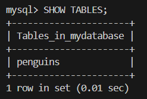

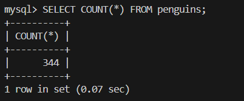

Para salir del motor de base de datos, y regresar a la terminal desde donde seguiremos levantando los diferentes servicios usamos el comando **exit** dos veces.

```Bash
exit # para salir del motor de base de datos
exit # para salir del entorno bash del contenedor
```

En caso de que sea necesario eliminar el contenedor junto con sus imágenes y volúmenes asociados para este servicio, se puede ejecutar el siguiente comando:

```Bash
sudo docker compose -f docker-compose-mysql.yaml down -v --rmi all
```
Este procedimiento garantiza que cualquier actualización en el archivo **docker-compose-mysql.yaml** se aplique de manera efectiva al volver a desplegar el servicio.


El siguiente servicio que se desplegará es **MLflow**, el cual se ejecuta directamente sobre la máquina virtual. Sin embargo, el motor de base de datos que MLflow utilizará se levanta mediante un contenedor de **PostgreSQL**.

Para garantizar una correcta conexión y funcionamiento, es necesario instalar previamente en la máquina virtual las dependencias requeridas. Para ello, ejecutamos los siguientes comandos en la terminal:

Para la correcta conexión con el servicio de **PostgreSQL** desde la máquina virtual, es necesario instalar el cliente común de PostgreSQL con el comando:

```Bash
sudo apt install postgresql-client-common
```
Y el conector para la comunicación con el contenedor con el comando:

```Bash
pip install psycopg2-binary
```

Para desplegar la base de datos **PostgreSQL**, utilizamos el siguiente comando de Docker Compose, asegurándonos de habilitar el puerto 5432 en localhost, lo que permitirá la conexión del servicio de MLflow cuando lo iniciemos:

```Bash
sudo docker compose -f docker-compose-postgresql.yaml up --build -d
```

Luego de haber arrancado el contenedor con el motor de base de datos PostgreSQL, verificamos que se encuentre desplegado con:

```Bash
docker ps
```

Con el contenedor de PostgreSQL en ejecución, procedemos a instalar MLflow junto con sus dependencias necesarias para ejecutarlo dentro de la máquina virtual. Para ello, utilizamos el siguiente comando:

```Bash
sudo pip install mlflow awscli boto3
```

Para parametrizar el despliegue del servicio **MLflow**, creamos el archivo de script **start_mlflow.sh**, el cual alojamos dentro de la carpeta **mlflow/**. Este script contiene los comandos necesarios para iniciar el servidor de MLflow con la configuración adecuada.

Además, configuramos un servicio del sistema mediante el archivo **mlflow_serv.service**, que permite gestionar el servicio de MLflow como un proceso en segundo plano, asegurando su disponibilidad incluso después de reinicios del sistema.

Para iniciar el servicio de MLflow utilizamos los siguientes comandos:

```Bash
sudo systemctl daemon-reload
sudo systemctl enable /home/estudiante/Documents/MLOPS_PUJ_Grupo6/taller_mlflow/mlflow_serv.service
sudo systemctl start mlflow_serv.service
sudo systemctl status mlflow_serv.service 
```

Luego de ejecutar este conjunto de comandos, podemos verificar la actividad del servicio mediante el comando 

```Bash
sudo ss -tlnp | grep :5000
```

Para verificar que el servicio de MLflow se encuentra activo correctamente, primero necesitamos configurar el reenvío de puertos en VS Code, permitiendo acceder a MLflow Tracking UI desde el localhost de la máquina pivote.

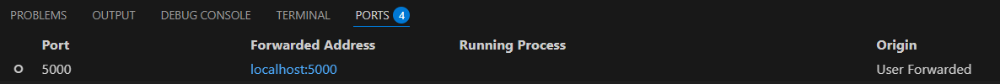

Con la configuración correcta, entramos desde un navegador a 

```Bash 
http://localhost:5000
```

Donde podemos observar el UI de MLflow.

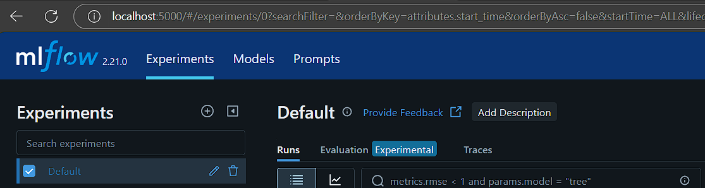

En caso de que no se vea un despliegue correcto se puede reiniciar el servicio mediante los comandos 

```Bash
sudo systemctl daemon-reload
sudo systemctl restart mlflow_serv.service
```

En dado caso que se requiera eliminar el servicio de MLflow, se hace mediante el comando 

```Bash
sudo systemctl stop mlflow_serv.service
```


El siguiente servicio a desplegar es **MinIO**, un sistema de almacenamiento de objetos compatible con **Amazon S3**, que será utilizado para almacenar artefactos de los experimentos de MLflow.

Dado que el código de configuración de este servicio ya ha sido proporcionado, podemos iniciarlo directamente con el siguiente comando en la terminal:

```Bash
sudo docker compose -f docker-compose-minio.yaml up --build -d
```

Una vez que el contenedor de MinIO ha sido iniciado, podemos verificar su correcto funcionamiento accediendo a su interfaz web. Para ello, primero debemos asegurarnos de que el puerto **9001** esté correctamente configurado en VS Code, lo que permitirá acceder a MinIO desde cualquier navegador.

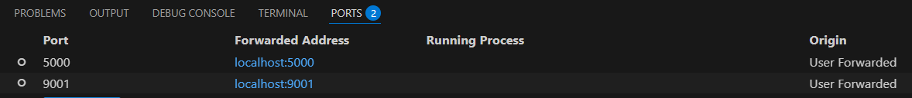

A partir de cualquier navegador ingresamos a la URL

```Bash
http://localhost:9001
```

Una vez que hemos accedido a la interfaz web de MinIO, procedemos a crear un bucket con el nombre **mlflows3**, que será utilizado para almacenar los artefactos de MLflow.

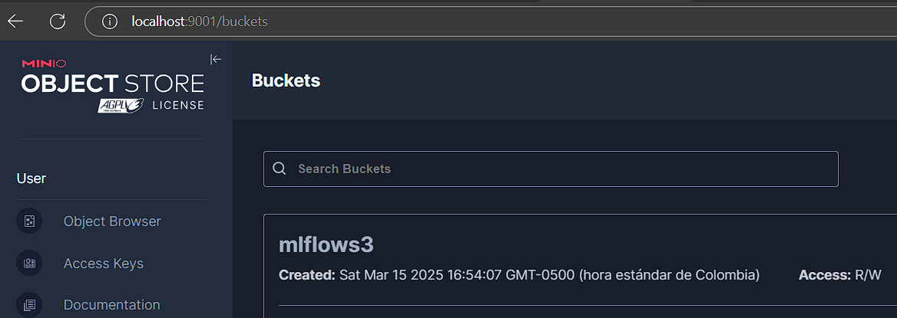

En dado caso de requerirlo podemos destruir el contenedor, con volumen e imagen construida con el comando:

```Bash
sudo docker compose -f docker-compose-minio.yaml down -v --rmi all
```

Una vez que los tres servicios (PostgreSQL, MLflow y MinIO) están en ejecución, procedemos a conectarlos mediante una **red compartida** en **Docker**, lo que permitirá la comunicación entre los contenedores sin necesidad de exponer puertos adicionales en el host.

Para ello, iniciamos creando una red de Docker con el siguiente comando:

```Bash
sudo docker network create mi_red_compartida
```

Agregamos los contenedores a la red mediante los comandos:

```Bash
sudo docker network connect mi_red_compartida mysql_model_data
sudo docker network connect mi_red_compartida mlflow_postgres
sudo docker network connect mi_red_compartida Minio
```

Por último verificamos que los servicios estén enlazados dentro de la red creada mediante el comando:

```Bash
sudo docker network inspect mi_red_compartida
```

Para proceder con el levantamiento del servicio de JupyterLab, donde realizaremos experimentos en MLflow con múltiples ejecuciones hasta obtener un resultado óptimo que será publicado en la plataforma de MLflow, seguimos los siguientes pasos.

Construimos la imagen del servicio del JupyterLab mediante: 

```Bash
sudo docker build -t jupyterlab JupyterLab/.
```

Levantamos el servicio mediante:

```Bash
sudo docker run -it --name jupyterlab --rm -e TZ=America/Bogota \
    --network mi_red_compartida -p 8888:8888 \
    -v $PWD:/work jupyterlab:latest
```

Luego de haber logrado el levantamiento del servicio, proseguimos a configurar el puerto para acceder a la UI de JupyterLab mediante la URL

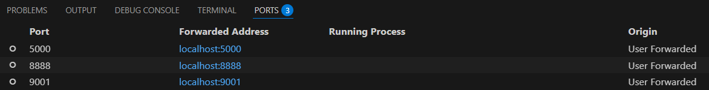

```Bash
http://localhost:8888
```

Dentro de la UI de JupyterLab, navegamos hasta la ruta:

```
JupyterLab/mlflow_pipeline.ipynb
```

Abrimos el notebook, donde se encuentra el código necesario para ejecutar el experimento con múltiples corridas. A lo largo del proceso, MLflow registrará cada ejecución, permitiéndonos comparar métricas y seleccionar el mejor modelo. Finalmente, el modelo óptimo será publicado dentro de la plataforma de MLflow, asegurando su trazabilidad y disponibilidad para futuras implementaciones.

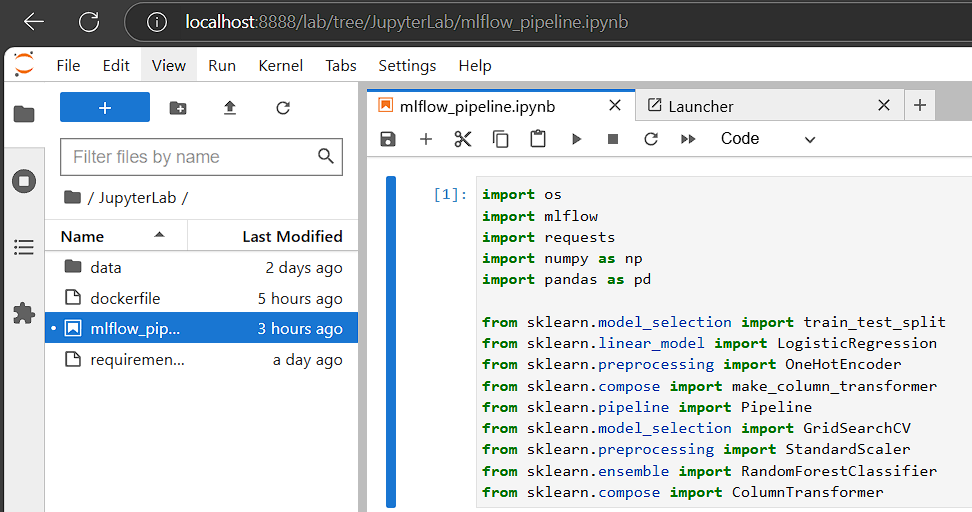

A continuación mostramos el flujo del manejo de los datos:

1. **Carga de datos:** Se extrae la información directamente desde la base de datos **MySQL**, alojándola en un **DataFrame de pandas**.  

2. **Selección del conjunto de datos:** Se divide la información en **datos de entrenamiento y validación**.  

3. **Preprocesamiento de datos:** Se define la transformación de **variables categóricas y numéricas**, integrándolas en un **Pipeline de Scikit-Learn**.  

4. **Optimización del modelo con GridSearchCV:**  
   - Se define un **`GridSearchCV`** con la combinación de parámetros seleccionados.  
   - Se prueban **3 valores** para los hiperparámetros:
     - `classifier__n_estimators`
     - `classifier__max_depth`
     - `classifier__min_samples_split`
   - Esto genera un total de **27 experimentos**.

5. **Entrenamiento y registro en MLflow:**  
   - Se establece la **conexión con MLflow**.  
   - Se entrena el modelo y se almacenan todos los experimentos en **MLflow** dentro del experimento `mlflow_penguins_vf`.  
   - Se habilita **autologging** para registrar automáticamente todos los detalles del entrenamiento.  
   - Se selecciona el **mejor modelo** y se registra con el nombre `modelo_penguins`.  
   - Se usa `max_tuning_runs` para garantizar que todas las ejecuciones sean almacenadas correctamente en MLflow.


Además del registro en **MLflow**, se garantiza que **todos los artefactos generados** durante el proceso de entrenamiento, como modelos, métricas y configuraciones, sean almacenados en **MinIO**. Esto permite una gestión eficiente y centralizada de los resultados del entrenamiento.

El uso de **MinIO** asegura que los archivos sean accesibles de manera estructurada y puedan ser recuperados fácilmente para futuras evaluaciones o despliegues del modelo.

## MlFlow

Una vez ejecutado el proceso en nuestro notebook, podemos acceder a la **interfaz de MLflow** para confirmar que las ejecuciones se han registrado correctamente.

<div align="center">
  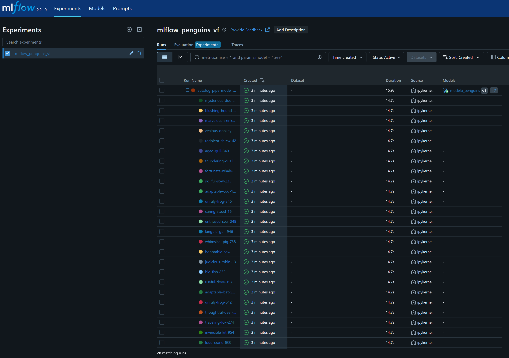
</div>

Adicionalmente, se verifica que el mejor modelo haya sido registrado correctamente

<div align="center">
  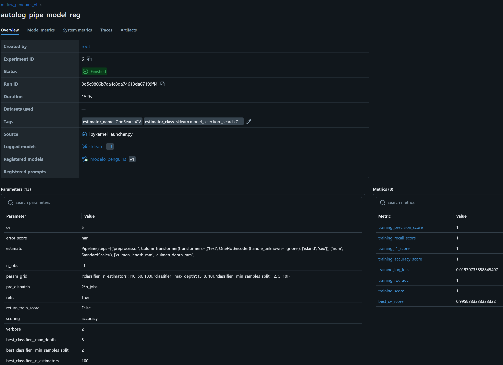
</div>

Finalmente, se cambia el Stage del modelo a Production, para garantizar que posteriormente pueda ser consumido por el API. 

<div align="center">
  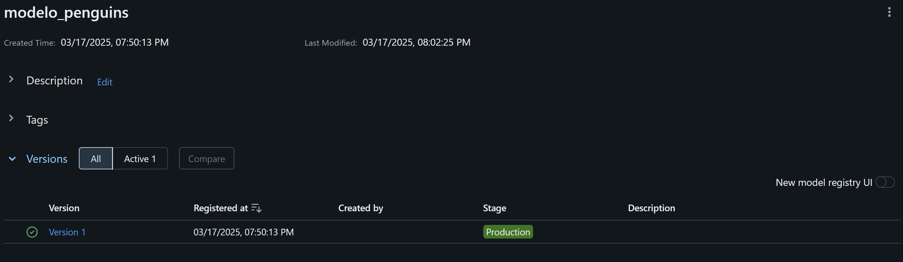
</div>

## FastAPI

Una vez que el modelo ha sido **disponibilizado en MLflow**, procedemos a la creación de una **API** que permita realizar predicciones basadas en el modelo entrenado. Para ello, utilizaremos **FastAPI** como base, reutilizando el código desarrollado en talleres anteriores, pero aplicando los siguientes cambios:

1. **Actualización de dependencias**  
   - Se actualiza el archivo `requirements.txt` para garantizar la compatibilidad con los modelos desarrollados y la librería **MLflow**.  

2. **Modificación del método `GET /listar_modelos`**  
   - Se ajusta este endpoint para listar **todos los modelos disponibles en MLflow**.  

3. **Modificación del método `POST /predict`**  
   - Permite usar un modelo desde la lista de modelos disponibles en MLflow.  
   - Carga el modelo seleccionado directamente desde **MLflow Model Registry**.  
   - Realiza la predicción en base a los datos proporcionados.  

Con estos cambios, la API podrá gestionar múltiples modelos y realizar predicciones de manera eficiente utilizando MLflow como backend.

Para el despliegue de **FastAPI**, utilizamos **Docker Compose**, manteniendo la estructura del taller en la que cada servicio se despliega de manera independiente. Esto permite una gestión modular y escalable de los componentes. Para construir y desplegar el contenedor de la API, ejecuta el siguiente comando:

```bash
sudo docker-compose -f docker-compose-fastapi.yaml up --build -d
```

Al igual que con los otros contenedores, es fundamental garantizar que la **API de modelos** esté en la misma red para permitir la comunicación con los demás servicios. Para ello, conectamos el contenedor a la red **`mi_red_compartida`** con el siguiente comando:

```bash
docker network connect mi_red_compartida api_models
```

Una vez que la API ha sido completamente desplegada, podemos realizar una prueba para asegurarnos de que está funcionando correctamente y puede procesar solicitudes de predicción.

<div align="center">
  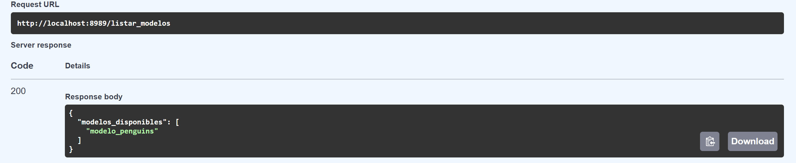
</div>

<div align="center">
  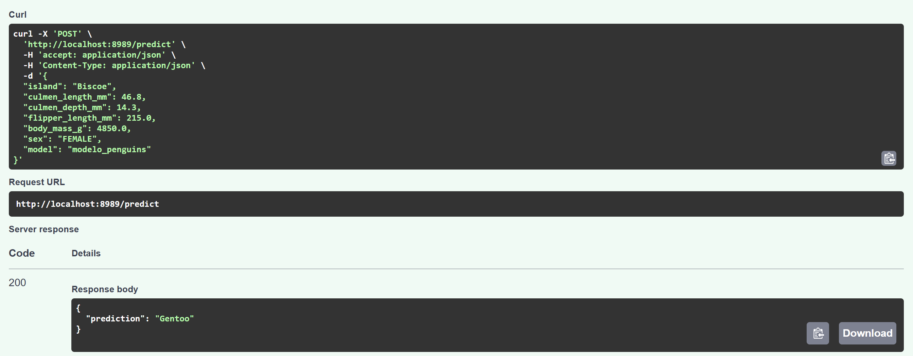
</div>

##  Aclaraciones del Código

Para el desarrollo de este experimento, utilizamos los recursos proporcionados por el profesor, adaptando la configuración de Docker Compose para desplegar los servicios de MySQL, PostgreSQL y MLflow de manera separada, cada uno con su propio archivo de configuración (docker-compose).

Además, se incorporó un servicio de FastAPI, lo que permite consumir el modelo publicado en MLflow para realizar predicciones en tiempo real. Para garantizar la persistencia de los datos, se configuró un volumen persistente, asegurando que MySQL funcione como base de datos externa sin pérdida de información durante el desarrollo del experimento.

Esta arquitectura modular facilita la administración de los servicios, mejora la reproducibilidad de los experimentos y permite una integración más flexible con sistemas externos.


